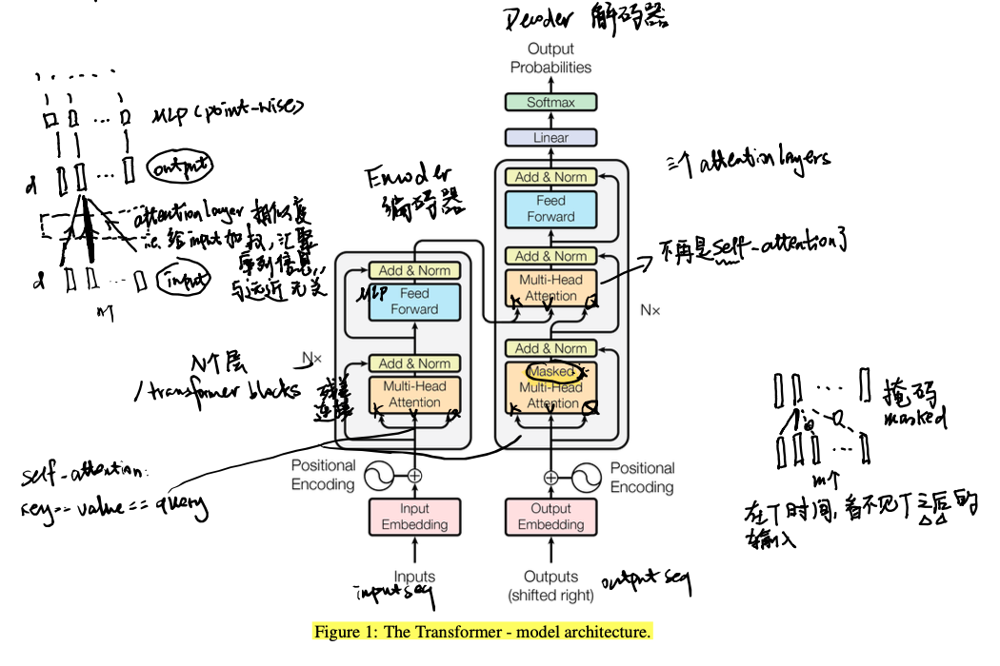
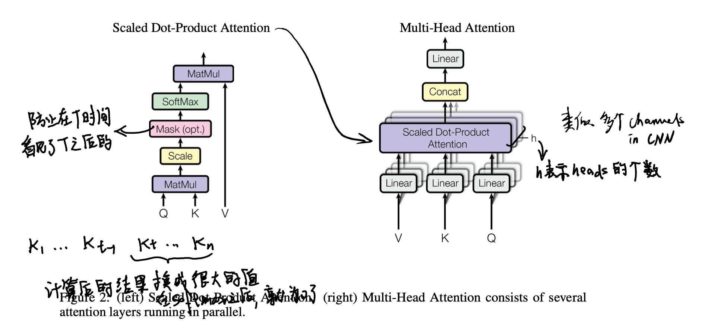
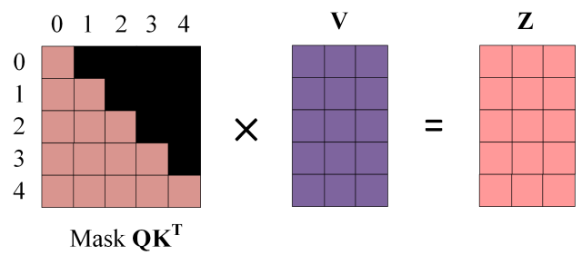
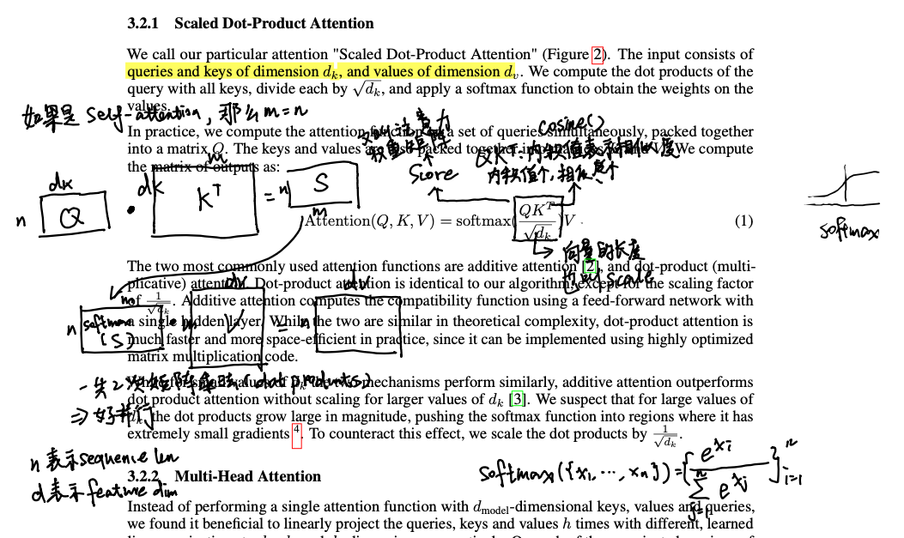

## Overview

**Transformer** is a neural network architecture designed to process sequences. It was introduced as an alternative to RNN-based models, with the core idea that a model should not pass information only step by step through time. Instead, it should be able to directly look at the whole sequence and decide which parts matter most.

The key mechanism is **attention**, which aggregates information from a sequence by assigning different weights to different tokens. Because of this, a Transformer can model long-range dependencies more effectively than traditional recurrent models.

A standard Transformer contains an **encoder** and a **decoder**.

- The **encoder** is built from repeated blocks of multi-head self-attention, residual connections, feed-forward layers, and layer normalization.
- The **decoder** is built from masked multi-head self-attention, encoder-decoder attention, feed-forward layers, residual connections, and layer normalization.

Besides the encoder and decoder, the Transformer also includes embedding layers, positional encodings, and an output projection followed by a softmax layer.

In practice, modern large language models often use decoder-only variants, but the original encoder-decoder design is still the standard starting point for understanding the architecture.

## Transformer vs. RNN

Transformer and RNN both aim to model sequence data, and both use nonlinear layers such as MLPs to transform representations into richer semantic spaces. The main difference is **how they pass sequence information** (如何传递序列信息).

In an **RNN**, information is propagated recurrently:

- the hidden state at time step `t` is passed to time step `t + 1`
- each step depends on previous steps in order
- computation is naturally sequential

This design makes it difficult to **parallelize training** across tokens (并行计算能力). It also makes learning **long-range dependencies** harder (全局信息交互), because information has to travel through many recurrent steps.

In a **Transformer**, sequence information is propagated through attention:

- each token can directly attend to all relevant tokens in the sequence
- the model does not need to move information one step at a time
- training is much more parallelizable

In summary, the difference is not that one understands sequences and the other does not. Both do. The difference is how sequence information is transmitted:

- **RNN**: passes information forward through recurrent hidden states
- **Transformer**: aggregates information globally through attention

## Attention and Its Math

Attention measures how much one token should focus on another token. It can be understood as a weighted aggregation of sequence information, regardless of distance in the sequence.

At a high level:

- `weight = similarity(query, key)`
- `output = weighted sum of values`

### Self-Attention

In **self-attention**, `Q`, `K`, and `V` all come from the same input sequence:

- **Query (Q)**: what the current token is looking for
- **Key (K)**: what each token offers for matching
- **Value (V)**: the information carried by each token

So self-attention means that each token compares itself with all tokens in the same sequence and then gathers the most relevant information.

### Masked Attention

In **masked self-attention**, token `t` is not allowed to see tokens after `t`. This is required in autoregressive language models, where prediction at position `t` must not use future tokens.

### Multi-Head Attention

**Multi-head attention** means using several attention heads in parallel. Each head can learn a different type of relation, such as syntax, local dependency, or long-range dependency. This is loosely similar to how different CNN channels can capture different patterns.

### Scaled Dot-Product Attention

The Transformer paper defines scaled dot-product attention as:


$$
\operatorname{Attention}(Q, K, V)
=
\operatorname{softmax}\left(\frac{QK^\top}{\sqrt{d_k}}\right)V
$$


Parameters:
- $Q \in \mathbb{R}^{n \times d_k}$ is the query matrix, $K \in \mathbb{R}^{m \times d_k}$ is the key matrix, and $V \in \mathbb{R}^{m \times d_v}$ is the value matrix. In self-attention, $m = n$.
- $n$ is the number of query tokens, $m$ is the number of key/value tokens, and $d_k$ is the query/key feature dimension.

Breaking down the equation:
- The term $QK^\top \in \mathbb{R}^{n \times m}$ is the inner product (cosine) and measures **similarity** between tokens.
- $\sqrt{d_k}$ rescales the scores for numerical stability.
- $\frac{QK^\top}{\sqrt{d_k}}$ is called the **attention weight matrix** or **score matrix**.
- $softmax$ turns the scores into attention weights used to combine the values.

So we calculated the attetion using two matrix multiplications. This makes parallel execution easy. The images below illustrates these two matrix multiplications [^1]:

### Parameter Count

A Transformer model consists of $l$ identical layers. Each layer has two parts: a self-attention block and an MLP block.

**The self-attention block** contains the weight matrices $W_Q$, $W_K$, $W_V$, and $W_O$, together with their biases. The four weight matrices satisfy $W_Q, W_K, W_V, W_O \in \mathbb{R}^{n \times n}$, and the four bias vectors satisfy $b_Q, b_K, b_V, b_O \in \mathbb{R}^{n}$. Therefore, the number of parameters in the self-attention block is 


$$
4n^2 + 4n
$$


**The MLP block** consists of two linear layers. In general, the first linear layer maps the hidden dimension from $n$ to $4n$, and the second maps it back from $4n$ to $n$. For the first linear layer, $W_1 \in \mathbb{R}^{n \times 4n}$ and $b_1 \in \mathbb{R}^{4n}$. For the second linear layer, $W_2 \in \mathbb{R}^{4n \times n}$ and $b_2 \in \mathbb{R}^{n}$. So the total number of parameters in the MLP block is 


$$
8n^2 + 5n
$$


The self-attention block and the MLP block each have one layer normalization. Each layer normalization has two trainable parameters: the scale parameter $\gamma$ and the shift parameter $\beta$, with $\gamma, \beta \in \mathbb{R}^{n}$. Therefore, the two layer normalizations contribute $4n$ parameters in total.

Hence, the total number of parameters in each Transformer layer is 


$$
(4n^2 + 4n) + (8n^2 + 5n) + 4n = 12n^2 + 13n
$$


In addition, **the token embedding matrix** contributes a large number of parameters. Since the embedding dimension is usually equal to the hidden dimension $n$, the embedding matrix $E \in \mathbb{R}^{V \times n}$ has $Vn$ parameters, where $V$ is the vocabulary size.

The final output projection usually shares its weight matrix with the token embedding matrix, so it does not introduce an additional $Vn$ parameters in that case. For positional encoding, trainable positional embeddings introduce some additional parameters, but relatively few. If relative positional encoding is used, such as RoPE or ALiBi, then this part has no trainable parameters. We ignore positional-encoding parameters here.

Therefore, for a Transformer model with $l$ layers, **the total number of trainable parameters** (参数量) is 


$$
l(12n^2 + 13n) + Vn
$$


When the hidden dimension $n$ is large, the linear terms can be neglected, so the total parameter count is approximately


$$
12ln^2
$$


Using the approximation $P \approx 12ln^2$, we can estimate the parameter counts of several well-known Llama 3 models:

| Model | $l$ | $n$ | $12ln^2$ | Approx. |
| --- | ---: | ---: | ---: | ---: |
| 8B | 32 | 4096 | $6{,}442{,}450{,}944$ | $6.44\text{B}$ |
| 70B | 80 | 8192 | $64{,}424{,}509{,}440$ | $64.42\text{B}$ |
| 405B | 126 | 16384 | $405{,}874{,}409{,}472$ | $405.87\text{B}$ |

This is only a rough estimate. It is close for 405B, but it underestimates the 8B and 70B models because the formula ignores embeddings, output-layer choices, grouped-query attention details, and exact MLP dimensions.

### FLOPs

> FLOPs (计算量), or floating-point operations, measure computational cost.

> For $A \in \mathbb{R}^{m \times n}$ and $B \in \mathbb{R}^{n \times p}$, the matrix multiplication $AB$ costs $2mnp$ FLOPs.

In one training iteration, let the input token shape be $[b, s]$, where $b$ is the batch size and $s$ is the sequence length. After embedding, the hidden states are $x \in \mathbb{R}^{b \times s \times h}$, where $h$ is the hidden size. 

For a **self-attention** block,

$$
Q = xW_Q,\quad K = xW_K,\quad V = xW_V
$$

$$
x_{\text{out}} = \operatorname{softmax}\left(\frac{QK^T}{\sqrt{h}}\right)V W_o + x
$$

1. Computing $Q$, $K$, and $V$: $x \in \mathbb{R}^{b \times s \times h}$, $W_Q \in \mathbb{R}^{h \times h}$, $W_K \in \mathbb{R}^{h \times h}$, and $W_V \in \mathbb{R}^{h \times h}$, so $Q \in \mathbb{R}^{b \times s \times h}$, $K \in \mathbb{R}^{b \times s \times h}$, and $V \in \mathbb{R}^{b \times s \times h}$. The FLOPs are:
   $$
   3 \cdot 2bsh^2 = 6bsh^2
   $$

2. Computing $QK^T$: $Q \in \mathbb{R}^{b \times n_{\mathrm{head}} \times s \times d_{\mathrm{head}}}$ and $K^T \in \mathbb{R}^{b \times n_{\mathrm{head}} \times d_{\mathrm{head}} \times s}$, so $QK^T \in \mathbb{R}^{b \times n_{\mathrm{head}} \times s \times s}$. So the FLOPs are:
   $$
   2bs^2h
   $$

3. Computing $\text{score} \cdot V$:
   $\text{score} \in \mathbb{R}^{b \times n_{\mathrm{head}} \times s \times s}$ and $V \in \mathbb{R}^{b \times n_{\mathrm{head}} \times s \times d_{\mathrm{head}}}$, so $\text{score} \cdot V \in \mathbb{R}^{b \times n_{\mathrm{head}} \times s \times d_{\mathrm{head}}}$. So the FLOPs are:
   $$
   2bs^2h
   $$

4. The output projection after attention:
   $x_{\text{attn}} \in \mathbb{R}^{b \times s \times h}$ and $W_o \in \mathbb{R}^{h \times h}$, so $x_{\text{attn}}W_o \in \mathbb{R}^{b \times s \times h}$. So the FLOPs are:
   $$
   2bsh^2
   $$

For the **MLP** block,

$$
x = f_{\text{gelu}}(x_{\text{out}}W_1)W_2 + x_{\text{out}}
$$

1. First linear layer:
   $x_{\text{out}} \in \mathbb{R}^{b \times s \times h}$ and $W_1 \in \mathbb{R}^{h \times 4h}$, so $x_{\text{out}}W_1 \in \mathbb{R}^{b \times s \times 4h}$. So the FLOPs are:
   $$
   8bsh^2
   $$
2. Second linear layer:
   $f_{\text{gelu}}(x_{\text{out}}W_1) \in \mathbb{R}^{b \times s \times 4h}$ and $W_2 \in \mathbb{R}^{4h \times h}$, so $f_{\text{gelu}}(x_{\text{out}}W_1)W_2 \in \mathbb{R}^{b \times s \times h}$. So the FLOPs are:
   $$
   8bsh^2
   $$

Adding them together, the FLOPs needed by **one Transformer layer** are approximately

$$
24bsh^2 + 4bs^2h
$$

At the very end of the Transformer architecture, there is the **final linear layer (logits)** that maps hidden states to vocabulary scores.
Given $h_{\text{out}} \in \mathbb{R}^{b \times s \times h} \quad$ and $W_{\text{vocab}} \in \mathbb{R}^{h \times V}$, we have $h_{\text{out}}W_{\text{vocab}} \in \mathbb{R}^{b \times s \times V}$. So the FLOPs are:

$$
2bshV
$$

Therefore, for a Transformer with $l$ layers and input shape $[b, s]$, the FLOPs of **one training iteration** are approximately

$$
l(24bsh^2 + 4bs^2h) + 2bshV
$$

## Parameter Count and FLOPs

## Layer Norm vs. Batch Norm

Both layer normalization and batch normalization are used to stabilize training, but they normalize over different dimensions.

**Batch normalization** computes statistics across the batch. Its behavior depends on the distribution of examples inside the mini-batch. This works well in many vision settings, but it is less suitable for sequence models when:

- sequence lengths vary a lot
- token distributions change across positions
- batch statistics become unstable or less meaningful

**Layer normalization** computes statistics within each individual token representation. It does not depend on other examples in the batch, which makes it more stable for variable-length sequence modeling.

This is why Transformers typically use **layer normalization instead of batch normalization**. For language tasks, each token representation should be normalized independently, without relying on the composition of the current mini-batch.

## Positional Encoding

Positional encoding provides the model with information about the positions of words in a sequence. Since the Transformer's self-attention mechanism does not naturally account for the order of elements in the sequence, positional encoding solves this by adding position information to each element's representation. In the original Transformer paper, positional encodings are defined using alternating sine and cosine functions.

## FFN

Feed-forward network (FFN) provides the model with nonlinear processing capacity. It operates independently on each position of the input, helping increase the model's complexity and expressive power.

## Complete Code

[RethinkFun/DeepLearning `chapter15/transformer.py`](https://github.com/RethinkFun/DeepLearning/blob/master/chapter15/transformer.py)

[^1]: Transformer模型详解（图解最完整版）. 初识CV, Zhihu. <https://zhuanlan.zhihu.com/p/338817680>
