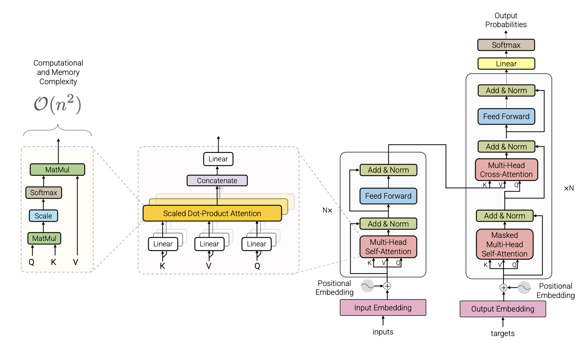

### Table of Contents

- [Overview](#overview)
- [Transformer vs. RNN](#transformer-vs-rnn)
- [Attention and Its Math](#attention-and-its-math)
- [Batch Norm and Layer Norm](#batch-norm-and-layer-norm)
- [Positional Encoding](#positional-encoding)
- [MLP or FFN](#mlp-or-ffn)
- [Residual Connection](#residual-connection)
- [Complete Code](#complete-code)

### Overview

**Transformer** is a neural network architecture designed to process sequences. It was introduced as an alternative to RNN-based models, with the core idea that a model should not pass information only step by step through time. Instead, it should be able to directly look at the whole sequence and decide which parts matter most.

The key mechanism is **attention**, which aggregates information from a sequence by assigning different weights to different tokens. Because of this, a Transformer can model long-range dependencies more effectively than traditional recurrent models.[^1]

A standard Transformer contains an **encoder** and a **decoder**.

- The **encoder** is built from repeated blocks of multi-head self-attention, residual connections, feed-forward layers, and layer normalization.
- The **decoder** is built from masked multi-head self-attention, encoder-decoder attention, feed-forward layers, residual connections, and layer normalization.

Besides the encoder and decoder, the Transformer also includes embedding layers, positional encodings, and an output projection followed by a softmax layer.

Below is the architecture of the standard Transformer [^2]:



In practice, modern large language models often use decoder-only variants, but the original encoder-decoder design is still the standard starting point for understanding the architecture.

### Transformer vs. RNN

Transformer and RNN both aim to model sequence data, and both use nonlinear layers such as MLPs to transform representations into richer semantic spaces. The main difference is **how they pass sequence information** (如何传递序列信息).

In an **RNN**, information is propagated recurrently:

- the hidden state at time step `t` is passed to time step `t + 1`
- each step depends on previous steps in order
- computation is naturally sequential

This design makes it difficult to **parallelize training** across tokens (并行计算能力). It also makes learning **long-range dependencies** harder (全局信息交互), because information has to travel through many recurrent steps.

In a **Transformer**, sequence information is propagated through attention:

- each token can directly attend to all relevant tokens in the sequence
- the model does not need to move information one step at a time
- training is much more parallelizable

In summary, the difference is not that one understands sequences and the other does not. Both do. The difference is how sequence information is transmitted:

- **RNN**: passes information forward through recurrent hidden states
- **Transformer**: aggregates information globally through attention


### Attention and Its Math

Attention measures how much one token should focus on another token. It can be understood as a weighted aggregation of sequence information, regardless of distance in the sequence.

At a high level:

- `weight = similarity(query, key)`
- `output = weighted sum of values`

**Self-Attention**

In self-attention, `Q`, `K`, and `V` all come from the same input sequence:

- **Query (Q)**: what the current token is looking for
- **Key (K)**: what each token offers for matching
- **Value (V)**: the information carried by each token

So self-attention means that each token compares itself with all tokens in the same sequence and then gathers the most relevant information.


**Masked Attention**

In masked self-attention, token `t` is not allowed to see tokens after `t`. This is required in autoregressive language models, where prediction at position `t` must not use future tokens.

**Scaled Dot-Product Attention**

The Transformer paper defines scaled dot-product attention as:


$$
\operatorname{Attention}(Q, K, V)
=
\operatorname{softmax}\left(\frac{QK^\top}{\sqrt{d_k}}\right)V
$$


Parameters:
- $Q \in \mathbb{R}^{n \times d_k}$ is the query matrix, $K \in \mathbb{R}^{m \times d_k}$ is the key matrix, and $V \in \mathbb{R}^{m \times d_v}$ is the value matrix. In self-attention, $m = n$.
- $n$ is the number of query tokens, $m$ is the number of key/value tokens, and $d_k$ is the query/key feature dimension.

Breaking down the equation:
- The term $QK^\top \in \mathbb{R}^{n \times m}$ is the inner product (cosine) and measures **similarity** between tokens.
- $\sqrt{d_k}$ rescales the scores for numerical stability.
- $\frac{QK^\top}{\sqrt{d_k}}$ is called the **attention weight matrix** or **score matrix**.
- $softmax$ turns the scores into attention weights used to combine the values.

So we calculated the attetion using two matrix multiplications. This makes parallel execution easy. The images below illustrates these two matrix multiplications [^3]:








**Multi-Head Attention (MHA)**

Multi-head attention means using several attention heads in parallel. Each head can learn a different type of relation, such as syntax, local dependency, or long-range dependency. This is loosely similar to how different CNN channels can capture different patterns.


Here is the Pytorch code for a simple MHA block:

```python
class MultiHeadAttentionBlock(nn.Module):
    """
    Multi-head self-attention block.

    Args:
        dim (int): Input and output dimension of each token representation.
        n_head (int): Number of attention heads.
    """

    def __init__(self, dim: int, n_head: int) -> None:
        """
        Initializes the multi-head attention projections.

        Args:
            dim (int): Input and output dimension of each token representation.
            n_head (int): Number of attention heads.
        """
        super().__init__()
        self.dim = dim
        self.n_head = n_head
        assert dim % n_head == 0

        self.d_k = dim // n_head  # Per-head feature dimension.
        self.w_q = nn.Linear(dim, dim, bias=False)  # Wq
        self.w_k = nn.Linear(dim, dim, bias=False)  # Wk
        self.w_v = nn.Linear(dim, dim, bias=False)  # Wv
        self.w_o = nn.Linear(dim, dim, bias=False)  # Wo

    @staticmethod
    def attention(query, key, value, mask):
        """
        Computes scaled dot-product attention for all heads.

        Args:
            query (torch.Tensor): Query tensor of shape (batch, n_head, seq_len, d_k).
            key (torch.Tensor): Key tensor of shape (batch, n_head, seq_len, d_k).
            value (torch.Tensor): Value tensor of shape (batch, n_head, seq_len, d_k).
            mask (torch.Tensor | None): Optional attention mask.

        Returns:
            tuple[torch.Tensor, torch.Tensor]: Attention output of shape
            (batch, n_head, seq_len, d_k) and attention scores of shape
            (batch, n_head, seq_len, seq_len).
        """
        d_k = query.shape[-1]
        attention_scores = (query @ key.transpose(-2, -1)) / math.sqrt(d_k)  # (batch, n_head, seq_len, seq_len)
        if mask is not None:
            attention_scores.masked_fill_(mask == 0, -1e9)
        attention_scores = attention_scores.softmax(dim=-1)  # (batch, n_head, seq_len, seq_len)
        return (attention_scores @ value), attention_scores  # (batch, n_head, seq_len, d_k)

    def forward(self, q, k, v, mask):
        """
        Forward pass for multi-head attention.

        Args:
            q (torch.Tensor): Query tensor of shape (batch, seq_len, dim).
            k (torch.Tensor): Key tensor of shape (batch, seq_len, dim).
            v (torch.Tensor): Value tensor of shape (batch, seq_len, dim).
            mask (torch.Tensor | None): Optional attention mask.

        Returns:
            torch.Tensor: Output tensor of shape (batch, seq_len, dim).
        """
        query = self.w_q(q)  # (batch, seq_len, dim) --> (batch, seq_len, dim)
        key = self.w_k(k)  # (batch, seq_len, dim) --> (batch, seq_len, dim)
        value = self.w_v(v)  # (batch, seq_len, dim) --> (batch, seq_len, dim)

        # Split dim into n_head smaller subspaces, one for each head.
		# (batch, seq_len, dim) --> (batch, seq_len, n_head, d_k) --> (batch, n_head, seq_len, d_k)
        query = query.view(query.shape[0], query.shape[1], self.n_head, self.d_k).transpose(1, 2)
        key = key.view(key.shape[0], key.shape[1], self.n_head, self.d_k).transpose(1, 2)
        value = value.view(value.shape[0], value.shape[1], self.n_head, self.d_k).transpose(1, 2)

        # Apply scaled dot-product attention independently in each head.
        x, self.attention_scores = MultiHeadAttentionBlock.attention(query, key, value, mask)

        # Concatenate all head outputs back into the full model dimension.
        x = x.transpose(1, 2).contiguous().view(x.shape[0], -1, self.n_head * self.d_k)

        # Final linear projection output after merging the heads.
        return self.w_o(x)
```


### Batch Norm and Layer Norm

Both layer normalization and batch normalization are used to stabilize training, but they normalize over different dimensions.

$$
\hat{x} = \frac{x - \mu}{\sigma + \epsilon}
$$

**Batch normalization** computes statistics across the batch. Its behavior depends on the distribution of examples inside the mini-batch. This works well in many vision settings, but it is less suitable for sequence models when sequence lengths vary a lot, token distributions change across positions, or batch statistics become unstable or less meaningful. In the equation above, $\mu$ and $\sigma$ are computed across the batch dimension for each feature channel.

**Layer normalization** computes statistics within each individual token representation. It does not depend on other examples in the batch, which makes it more stable for variable-length sequence modeling.[^4] In the equation above, $\mu$ and $\sigma$ are computed from the features of one sample/token.



This is why Transformers use layer normalization instead of batch normalization. For language tasks, each token representation should be normalized independently, without relying on the composition of the current mini-batch.

Here is the Pytorch code for a simple layer norm block:

```python
class LayerNorm(nn.Module):
    """
    Layer Normalization.

    Args:
        dim (int): Dimension of the input tensor.
        eps (float): Epsilon value for numerical stability. Defaults to 1e-6.
    """

    def __init__(self, dim: int, eps: float = 10 ** -6) -> None:
        """
        Initializes the LayerNorm module.

        Args:
            dim (int): Dimension of the input tensor.
            eps (float): Epsilon value for numerical stability.
        """
        super().__init__()
        self.eps = eps
        self.weight = nn.Parameter(torch.ones(dim))

    def forward(self, x):
        """
        Forward pass for LayerNorm.

        Args:
            x (torch.Tensor): Input tensor of shape (batch, seq_len, hidden_size).

        Returns:
            torch.Tensor: Normalized tensor with the same shape as input.
        """
        mean = x.mean(dim=-1, keepdim=True)
        std = x.std(dim=-1, keepdim=True)
        return self.weight * (x - mean) / (std + self.eps)
```


### Positional Encoding

Positional encoding provides the model with information about the positions of words in a sequence. Since the Transformer's self-attention mechanism does not naturally account for the order of elements in the sequence, positional encoding solves this by adding position information to each element's representation. In the original Transformer paper, positional encodings are defined using **alternating sine and cosine functions**:


$$
\operatorname{PE}(pos, 2i) = \sin\left(\frac{pos}{10000^{2i/d_{\mathrm{model}}}}\right)
$$



$$
\operatorname{PE}(pos, 2i+1) = \cos\left(\frac{pos}{10000^{2i/d_{\mathrm{model}}}}\right)
$$


, where $pos$ is token position in the sequence and $i$ is the index of the sine-cosine pair inside the embedding dimension. Here is an illustration of how the positional encoding matrix is calculated [^5]:



Here is the Pytorch code for a simple positional encoding block:

```python
class PositionalEncoding(nn.Module):
    """
    Sinusoidal positional encoding for Transformer inputs.
    """

    def __init__(self, dim: int, seq_len: int) -> None:
        """
        Initializes the positional encoding table.

        Args:
            dim (int): Dimension of the input embeddings.
            seq_len (int): Maximum sequence length supported by the encoding.
        """
        super().__init__()
        position = torch.arange(0, seq_len, dtype=torch.float).unsqueeze(1)  # (seq_len, 1)
        div_term = torch.pow(10000.0, -torch.arange(0, dim, 2, dtype=torch.float) / dim)  # (dim / 2)
        pe = torch.zeros(seq_len, dim)  # (seq_len, dim)
        pe[:, 0::2] = torch.sin(position * div_term)  # sin(position / (10000 ** (2i / dim))
        pe[:, 1::2] = torch.cos(position * div_term)  # cos(position / (10000 ** (2i / dim))
        pe = pe.unsqueeze(0)  # (1, seq_len, dim)
        self.register_buffer('pe', pe)

    def forward(self, x):
        """
        Adds positional encodings to the input embeddings.

        Args:
            x (torch.Tensor): Input tensor of shape (batch, seq_len, dim).

        Returns:
            torch.Tensor: Tensor with positional encodings added, with the same shape as input.
        """
        return x + (self.pe[:, :x.shape[1], :])  # (batch, seq_len, dim)
```

### MLP or FFN

In a Transformer block, attention and the **feed-forward network** (**FFN**, also called the **MLP** block) play different roles.



The FFN block typically consists of two linear layers with a nonlinear activation in between:

$$
x = f_{\text{gelu}}(x_{\text{out}}W_1)W_2 + x_{\text{out}}
$$

只用MLP为啥不行呢？MLP 通过全连接层实现全局特征之间的交互，但其计算开销过高，因此难以无限制地向更深层堆叠。Transformer 则通过 attention 机制实现全局特征之间的选择性交互，在保留全局信息建模能力的同时，提供了更高效的结构化建模方式。

Here is the Pytorch code for a simple FFN block:

```python
class FeedForwardBlock(nn.Module):
    """Two-layer feed-forward block used in a Transformer.

    Attributes:
        linear_1 (nn.Module): Linear layer for input-to-hidden transformation.
        gelu (nn.GELU): Activation layer applied between the two linear projections.
        linear_2 (nn.Module): Linear layer for hidden-to-output transformation.
    """
    def __init__(self, dim: int, inter_dim: int) -> None:
        """
        Initializes the FFN layer.

        Args:
            dim (int): Input and output dimensionality.
            inter_dim (int): Hidden layer dimensionality.
        """
        super().__init__()
        self.linear_1 = nn.Linear(dim, inter_dim)
        self.gelu = nn.GELU()
        self.linear_2 = nn.Linear(inter_dim, dim)

    def forward(self, x):
        """
        Forward pass for the FFN layer.
        (batch, seq_len, dim) --> (batch, seq_len, inter_dim) --> (batch, seq_len, dim)

        Args:
            x (torch.Tensor): Input tensor.

        Returns:
            torch.Tensor: Output tensor after MLP computation.
        """
        return self.linear_2(self.gelu(self.linear_1(x)))
```

### Residual Connection

Residual connection helps mitigate vanishing gradients and degradation in deep models. The red arrows in the images below are residual connections [^6].



Here is the Pytorch code for a simple residual connection block:

```python
class ResidualConnection(nn.Module):

    def __init__(self, features: int) -> None:
        super().__init__()
        self.norm = LayerNorm(features)

    def forward(self, x, sublayer):
        return x + sublayer(self.norm(x))
```

###  PyTorch Code


[^1]: Ashish Vaswani, Noam Shazeer, Niki Parmar, Jakob Uszkoreit, Llion Jones, Aidan N. Gomez, Lukasz Kaiser, and Illia Polosukhin. Attention Is All You Need. arXiv, June 12, 2017. <https://arxiv.org/abs/1706.03762>
[^2]: Yi Tay, Mostafa Dehghani, Dara Bahri, and Donald Metzler. Efficient Transformers: A Survey. arXiv, September 14, 2020. <https://arxiv.org/abs/2009.06732>
[^3]: Transformer模型详解（图解最完整版）. 初识CV, Zhihu. <https://zhuanlan.zhihu.com/p/338817680>
[^4]: Jimmy Lei Ba, Jamie Ryan Kiros, and Geoffrey E. Hinton. Layer Normalization. arXiv, July 21, 2016. <https://arxiv.org/abs/1607.06450>
[^5]: Mehreen Saeed. A Gentle Introduction to Positional Encoding in Transformer Models, Part 1. Machine Learning Mastery, January 6, 2023. <https://machinelearningmastery.com/a-gentle-introduction-to-positional-encoding-in-transformer-models-part-1/>
[^6]: M Javadnejadi. “Transformer is All You Need”. AI Advances, April 30, 2024. <https://ai.gopubby.com/transformer-is-all-you-need-fbb1d1e4d9b0>
[^7]: RethinkFun/DeepLearning chapter15 <https://github.com/RethinkFun/DeepLearning/blob/master/chapter15/transformer.py>

