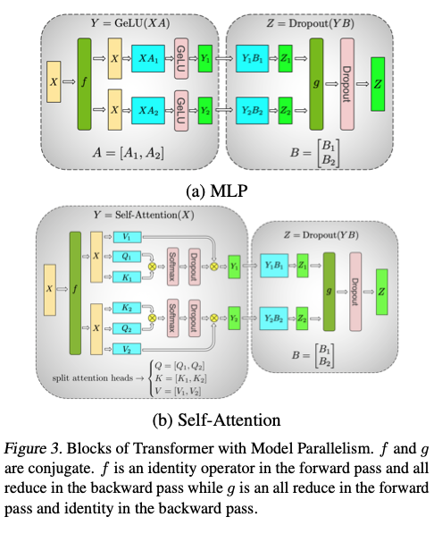
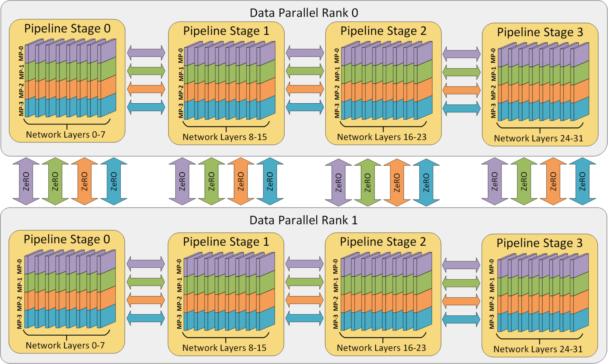

**Contents**

- [Why Model Parallelism?](#why-model-parallelism)
- [Tensor Parallelism](#tensor-parallelism)
- [Pipeline Parallelism](#pipeline-parallelism)
- [Sequence Parallelism](#sequence-parallelism)
- [Expert Parallelism](#expert-parallelism)
- [Automatic Parallelism](#automatic-parallelism)
- [Comparing the Strategies](#comparing-the-strategies)
- [Hybrid Parallelism](#hybrid-parallelism)

### Why Model Parallelism?

Data parallelism works well when the full model can still fit on each GPU. But once a model becomes too large, simply replicating it across devices is no longer practical.

Model parallelism solves this by partitioning the model itself across multiple GPUs. Instead of every rank storing all weights, each rank stores and computes only part of the model. The tradeoff is that memory usage goes down, but communication and scheduling complexity go up.

In practice, model parallelism usually appears in several forms: **tensor parallelism**, **pipeline parallelism**, **sequence parallelism**, **expert parallelism**, and **automatic parallelism**.

### Tensor Parallelism

Tensor parallelism (TP) splits the computation inside one layer across multiple GPUs. TP has good memory efficiency, reduces peak GPU memory usage, and speeds up computation. Each worker only stores the tensor shard it is responsible for, so the memory overhead per worker decreases linearly as the number of workers increases. However, TP has relatively high communication overhead between GPUs, because the forward or backward computation of each layer requires collective communication, such as All-Gather or All-Reduce.

**Megatron-LM** [^1] [^2]

Megatron shards the weight matrix across GPUs in two methods:
- **Column parallelism**: split the output dimension, so each GPU computes a subset of output columns.
- **Row parallelism**: split the input dimension, so each GPU computes a partial result and then sums across GPUs.

Now let's walk through an example using transformer encoder, which consists of one self-attention block and on MLP block. We define $b$ as the batch size, $s$ as the sequence length, $h$ as the hidden dimension, $n$ as the number of heads, and $p$ as the number of partitions. Tensor shapes are denoted using square brackets; for example, $[b, s, h]$ represents the standard input to a Transformer encoder.

Self-attention uses a column-parallel QKV projection and a row-parallel output projection:

| Step | Without Megatron | With Megatron |
| --- | --- | --- |
| QKV projection (input * weight) | $[b, s, h] \times [h, h] = [b, s, h]$ | $[b, s, h] \times [h, h/p] = [b, s, h/p]$ (column parallel)|
| Split into heads | For each of Q, K, and V, we have $n$ tensors of shape $[b, s, h/n]$ | For each of Q, K, and V, we have $n/p$ tensors of shape $[b, s, h/n]$ |
| Attention scores | $n$ computations of $QK^T$, each producing $[b, s, s]$ | $n/p$ computations of $QK^T$, each producing $[b, s, s]$ |
| Apply values | $n$ outputs of shape $[b, s, h/n]$ | $n/p$ outputs of shape $[b, s, h/n]$ |
| Concatenate heads | $[b, s, h]$ | Local result is $[b, s, h/p]$ |
| Output projection | $[b, s, h] \times [h, h] = [b, s, h]$ | $[b, s, h/p] \times [h/p, h] = [b, s, h]$ (row parallel) |
| Communication | None | All-reduce across $p$ GPUs |

The learnable parameters in self-attention are:
- QKV projection: $[h, h] \to [h, h/p]$ under tensor parallelism, which is **column parallelism**
- Output projection: $[h, h] \to [h/p, h]$, which is **row parallelism**

The MLP uses a column-parallel up projection and a row-parallel down projection:

| Step | Without Megatron | With Megatron |
| --- | --- | --- |
| Up projection | $[b, s, h] \times [h, 4h] = [b, s, 4h]$ | $[b, s, h] \times [h, 4h/p] = [b, s, 4h/p]$ (column parallel) |
| Down projection | $[b, s, 4h] \times [4h, h] = [b, s, h]$ | $[b, s, 4h/p] \times [4h/p, h] = [b, s, h]$ (row parallel) |
| Communication | None | All-reduce across $p$ GPUs |

The learnable parameters in the MLP are:
- Up projection: $[h, 4h] \to [h, 4h/p]$, which is **column parallelism**
- Down projection: $[4h, h] \to [4h/p, h]$, which is **row parallelism**

The shardings on the matrices are valid given the split of matmul is valid:

```
           |B1|
|A1, A2| x |B2| = A1 x B1 + A2 x B2
```



### Pipeline Parallelism

Pipeline parallelism (PP) splits the model by layers, partitioning several consecutive layers into one group, called a **stage**. Different stages are then assigned to different devices, so each GPU only computes a portion of the network’s layers.

For example, in a 12-layer transformer:

- GPU 0 may hold layers 1-4
- GPU 1 may hold layers 5-9
- GPU 2 may hold layers 10-12

After a batch arrives, the first stage begins the forward pass, then sends its output activations to the next stage, which continues the computation, and this process repeats until the last stage finishes. Backward propagation then starts from the last stage, and gradients are passed back stage by stage until the first stage completes its computation.

PP has good memory efficiency: each worker only stores the parameters of the stage it is responsible for, so the memory overhead per worker decreases linearly as the number of workers increases. In addition, PP has relatively low communication overhead, because it only needs to communicate activations and gradients between adjacent stages. The main challenge of PP is balancing the computation across stages so that idle time is minimized, as explained next.

A naive implementation of pipeline parallelism leaves many **pipeline bubble**, i.e. some devices sit idle at the beginning and end of each step while waiting for other stages. Hence, research on pipeline parallelism mainly focuses on:
1. reducing pipeline bubbles to improve overall system throughput
2. lowering the memory overhead on each worker so the system can scale to larger models

**GPipe**

The amount of time each GPU spends working is closely tied to the batch size it processes. To reduce this waiting time, GPipe, proposed by Google, presents a simple idea to further split a batch into multiple smaller sub-batches, called **micro-batches** [^3].



**PipeDream**

The PipeDream family was proposed by Microsoft's MSR Fiddle team [^4]. The core idea is to futher reduce pipeline bubbles. If multiple training iterations are in flight at the same time, each node can work on a different iteration at any given moment. This avoids waiting in place on strict step-by-step data dependencies and keeps the devices busy.





PipeDream partitions the model into pipeline stages by balancing per-stage compute, memory, and communication, so no single stage becomes the throughput bottleneck (划分任务). To address numerical issues from stale weights, it uses techniques like weight stashing and 1F1B scheduling so each microbatch’s forward and backward passes stay more consistent (收敛性问题).


### Sequence Parallelism

Two papers both discuss sequence parallelism (also called context parallelism) but with different goals and methods.

**Ring-Attention**

Before reading this section, please read the [FlashAttention](../../attention_3_flashattention/index.en.md) blog first.

Ring Attention is roughly a "distributed" version of FlashAttention-2 [^17]. In FlashAttention-2, both the outer loop over `Q` tiles and the inner loop over `K/V` tiles run on a single GPU. In Ring Attention, the `Q` tiles are first partitioned across multiple GPUs, and the `K/V` tiles are then circulated around those GPUs with ring communication. Each GPU updates its local output tile in essentially the same way as FlashAttention-2.

**Megatron-LM**

The first paper is Megatron-LM’s third paper, “Reducing Activation Recomputation in Large Transformer Models” [^5]. The motivation behind Megatron-LM’s sequence parallelism was to *distribute the memory that tensor parallelism could not shard anymore*.



**ColossalAI**

The other paper is ColossalAI’s “Sequence Parallelism: Long Sequence Training from a System Perspective” [^6]. It mainly addresses limitations from long input sequence length, which scales quadratically with self-attention's memory usage. It splits the input sequence into multiple chunks and feed each chunk to a GPU. It proposes the the Ring Self-Attention (RSA) to compute the attention.

<!-- 
大模型训练之序列并行双雄：DeepSpeed Ulysses & Ring-Attention - 方佳瑞的文章 - 知乎 https://zhuanlan.zhihu.com/p/689067888
-->


### Expert Parallelism

**MoE**

**Mixture of Experts** (MoE) is a neural network architecture that replaces one large feed-forward block with multiple specialized subnetworks called **experts**. Different experts learn to handle different kinds of tokens, since different tokens carry different meanings.

A **gating** or **routing** network routes each token to the most relevant expert or a small subset of experts. For each token, it assigns a probability to every expert, and we keep only the top-K experts with the highest probabilities. This can improve training effectiveness and increase model capacity without activating the whole model every time. There are topics like load balancing and token buffer, but we won't talk about them here.

Because each token uses only the top-K experts rather than all experts, an MoE layer is sparse. This also lets compute grow sublinearly as the model scales.

**Expert Parallelism**

Expert parallelism (EP) is mainly used with MoE models. In an MoE layer, a router sends each token to only a small subset of experts rather than activating the full dense feed-forward block [^7]. With EP, different experts are placed on different GPUs:

- GPU 0 and 1 hold experts 1-2
- GPU 2 and 3 hold experts 3-4



During the forward pass, a token may be routed to any expert, so we must send it to the target GPU, run the computation there, and then bring it back. This process of “cross-GPU transfer plus return to the original GPU” is **EP all-to-all**, and it is the core of expert parallelism: 
1. how do we efficiently route input tokens to the devices hosting their selected experts during the all-to-all **Dispatch phase**? 
2. how do we send the expert outputs back to the original devices and aggregate the results during the all-to-all **Combine phase**?



1. Communication Overhead

Let the local token tensor have shape $[b, s, h]$. In the MoE routing step, it is common to reshape it to $[b \cdot s, h]$, so each row corresponds to one token. After routing, each token is duplicated across its selected experts, so the routed tensor has shape $[b \cdot s \cdot \mathrm{top}\text{-}k, h]$.

If tokens are evenly distributed across $E$ EP ranks, the expected number of tokens that one rank sends or receives in a single all-to-all exchange is $\frac{b \cdot s \cdot \mathrm{top}\text{-}k \cdot (E - 1)}{E}$. Here, $\frac{E - 1}{E}$ is the probability that a routed token must be transferred to a different GPU, so the communication volume per phase is asymptotically $\mathcal{O}(b \cdot s \cdot \mathrm{top}\text{-}k)$. With half-precision activations, each element uses 2 bytes, so the communication cost per phase is approximately $2 \cdot b \cdot s \cdot \mathrm{top}\text{-}k \cdot h$ bytes. Since EP includes both a dispatch phase and a combine phase, the total communication is approximately $4 \cdot b \cdot s \cdot \mathrm{top}\text{-}k \cdot h$ bytes [^16].

2. Compute Efficiency

EP and TP have similar total FLOPs for expert computation, but EP tends to form fewer, larger GEMMs because tokens for the same local expert are gathered onto the rank that owns that expert, while TP shards each expert across ranks and therefore tends to form more, smaller GEMMs.

Overall, EP has an advantage over TP for expert computation: each kernel launch carries a larger workload, and the total number of kernel launches is lower.

3. Memory Usage

Under load imbalance, one rank may receive too many tokens, causing its activation memory usage to spike and potentially trigger an out-of-memory error. From a memory perspective, TP has a clear advantage: its memory usage is lower and more stable.

**GShard**

The GShard paper consists of two parts: one talks about the APIs ("GShard is a module composed of a set of lightweight annotation APIs and an extension to the XLA compiler."); the other discusses MoE. We focus on the second part here. GShard was the first work to extend the MoE idea to Transformers. Specifically, it replaced every other FFN layer in the Transformer encoder and decoder with a position-wise MoE layer, using a Top-2 gating network throughout [^7].



**DeepEP**

DeepSeek's DeepEP is a communication library designed specifically for MoE models and Expert Parallelism. It provides high-throughput, low-latency **all-to-all** CUDA kernels via NVLink and RDMA, aka MoE **dispatch** and **combine**. The library also supports low-precision operations, including FP8.

Megatron’s alltoall dispatcher has a relatively clean implementation, but it may suffer from communication redundancy. There are two levels of redundancy:
1. The same token may be dispatched to multiple experts on the same device.
2. The same token may be dispatched to different devices on the same host.

Overall, DeepEP reduces this redundancy through hierarchical dispatch and combine: two communication levels, inter-host and intra-host, plus three levels of permute and unpermute, across hosts, across devices within a host, and across experts within a device.

What suprises me is that the DeepEP's optimizations go very deep. This library uses **a custom PTX instruction**, `ld.global.nc.l1::no_allocate.l2::256b`, to improve global memory access by avoiding L1 cache allocation, reducing eviction, and taking advantage of 256-byte L2 cache transfers. DeepEP documents this optimization as an undefined-behavior technique and notes it can be disabled with DISABLE_AGGRESSIVE_PTX_INSTRS=1 on unsupported platforms [^13] [^14].


### Automatic Parallelism

(这段儿写的不太走心。。。)

The goal of automatic parallelism (自动并行) is straightforward: given a model and the available hardware resources, the system should automatically choose a good parallelization strategy for efficient execution.

There are two common modes:

- **Semi-automatic**: users provide limited sharding hints for some tensors or operators, and the framework propagates them through the computation graph. Representative systems include **Mesh-TensorFlow**, **GShard**, and **GSPMD** [^12] [^7] [^8].
- **Fully automatic**: the framework searches or synthesizes the strategy for all tensors and operators. Representative systems include **FlexFlow**, **Unity**, and **Alpa** [^9] [^10] [^11].

**Mesh-TensorFlow.** Standard SPMD often means data parallelism by splitting the batch dimension. Mesh-TensorFlow generalizes this idea by allowing other tensor dimensions to be partitioned as well. Each operation is lowered into parallel computation plus collective communication, and users describe model dimensions and device layout with a DSL; the system then maps the program onto a TPU mesh automatically [^12].

**GSPMD.** GSPMD uses **tensor sharding annotations** as a unified abstraction for different parallelization strategies. In practice, it keeps the user-facing programming model close to single-device programming, while inferring the partitioning for the remaining operators from a small number of annotations. Its SPMD partitioner can also support pipeline-style partitioning through a lightweight wrapper layer [^8].

**FlexFlow.** FlexFlow defines the **SOAP** search space, covering parallelization across the Sample, Operator, Attribute, and Parameter dimensions. On top of that space, it provides a deep learning framework that searches for an efficient strategy for a given model and machine configuration [^9].


### Comparing the Strategies

| Strategy | Split Dimension | Main Benefit | Main Cost |
| --- | --- | --- | --- |
| **Tensor Parallelism** | Within a layer | Fits very wide layers | Frequent collectives inside each block |
| **Pipeline Parallelism** | Across layers | Fits deep models | Pipeline bubbles and stage balancing |
| **Sequence Parallelism** | Across sequence length | Lowers activation memory | Extra coordination with TP |
| **Expert Parallelism** | Across experts | Scales parameter count efficiently | Token routing and `all_to_all` |


### Hybrid Parallelism

**3D Parallelism: TP+PP+DP**

The [Pipeline Parallelism](#pipeline-parallelism), [Tensor Parallelism](#tensor-parallelism), and [Data Parallel](/llm/distributed_training_3_zero_fsdp/) posts summarize the main memory and communication tradeoffs. We choose the parallelism dimensions in the order of their practical constraints. As a recap, TP is the most constrained, because its high communication cost usually prevents it from scaling efficiently across nodes. PP comes next, because its theoretical upper bound is limited by the number of layers in the model, and in practice each stage also cannot be made too small without hurting efficiency. DP is the least constrained, because in principle it can scale much further, and is mainly limited by batch size and communication efficiency at very large scale.

Now let's run through an example. Suppose the model has 512B parameters.

First, we apply PP, by partitioning the model into 4 stages, so each stage contains 128B parameters. Assign each stage to one 4-GPU node. We call it PP=4 or 4-way PP.

Next, we apply TP. Within each node, the stage is split into 4 shards, each holding 32B parameters. We call it TP=4 or 4-way TP.

Finally, we apply DP with one identical copies of the same 4-way PP + 4-way TP layout. Denote the first replica as $G_0^0, G_1^0, ..., G_15^0$, and the second replica as $G_0^1, G_1^1, ..., G_15^1$. Because DP can only be applied across GPUs that hold the same parameter shard, $G_0^0$ and $G_0^1$ form one DP group, $G_1^0$ and $G_1^1$ form another, and so on. In total, this creates 16 DP groups. Within each DP group, one can further apply ZeRO to improve memory efficiency.

Overall, for our 4-way TP + 4-way PP + 2-way DP case, we need 4 × 4 × 2 = 32 GPUs.




[^1]: Megatron-LM: Training Multi-Billion Parameter Language Models Using Model Parallelism. arXiv, September 17, 2019. <https://arxiv.org/abs/1909.08053>
[^2]: Efficient Large-Scale Language Model Training on GPU Clusters Using Megatron-LM. arXiv, April 9, 2021. <https://arxiv.org/abs/2104.04473>
[^3]: GPipe: Efficient Training of Giant Neural Networks using Pipeline Parallelism. arXiv, November 16, 2018. <https://arxiv.org/abs/1811.06965>
[^4]: PipeDream: Fast and Efficient Pipeline Parallel DNN Training. arXiv, June 9, 2018. <https://arxiv.org/abs/1806.03377>
[^5]: Reducing Activation Recomputation in Large Transformer Models. arXiv, May 5, 2022. <https://arxiv.org/abs/2205.05198>
[^6]: Sequence Parallelism: Long Sequence Training from a System Perspective. arXiv, May 27, 2021. <https://arxiv.org/abs/2105.13120>
[^7]: GShard: Scaling Giant Models with Conditional Computation and Automatic Sharding. arXiv, June 30, 2020. <https://arxiv.org/abs/2006.16668>
[^8]: GSPMD: General and Scalable Parallelization for ML Computation Graphs. arXiv, May 10, 2021. <https://arxiv.org/abs/2105.04663>
[^9]: Beyond Data and Model Parallelism for Deep Neural Networks. arXiv, July 14, 2018. <https://arxiv.org/abs/1807.05358>
[^10]: Unity: Accelerating DNN Training Through Joint Optimization of Algebraic Transformations and Parallelization. OSDI 2022. <https://www.usenix.org/conference/osdi22/presentation/unger>
[^11]: Alpa: Automating Inter- and Intra-Operator Parallelism for Distributed Deep Learning. arXiv, January 28, 2022. <https://arxiv.org/abs/2201.12023>
[^12]: Mesh-TensorFlow: Deep Learning for Supercomputers. arXiv, November 5, 2018. <https://arxiv.org/abs/1811.02084>
[^13]: DeepEP README, "Undefined-behavior PTX usage." GitHub. <https://github.com/deepseek-ai/DeepEP/tree/main?tab=readme-ov-file#undefined-behavior-ptx-usage>
[^14]: NVIDIA, "Parallel Thread Execution ISA." CUDA Toolkit Documentation. <https://docs.nvidia.com/cuda/archive/13.0.0/hopper-tuning-guide/parallel-thread-execution/index.html>. NVIDIA, "PTX and SASS Assembly Debugging." Nsight Visual Studio Edition User Guide. <https://docs.nvidia.com/nsight-visual-studio-edition/5.2/Content/PTX_SASS_Assembly_Debugging.htm>
[^15]: xffxff, "MoE 训练到底是开 TP 还是 EP？" Zhihu. <https://zhuanlan.zhihu.com/p/13997146226>
[^16]: MegaScale-MoE: Large-Scale Communication-Efficient Training of Mixture-of-Experts Models in Production. arXiv, May 16, 2025. <https://arxiv.org/abs/2505.11432>
