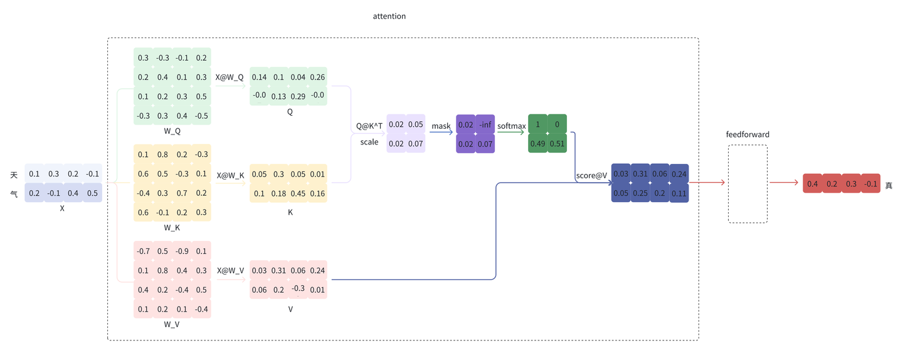
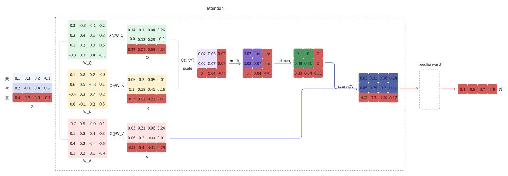
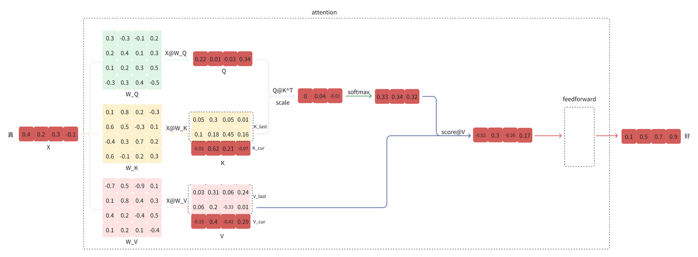

### What is KV Cache?
In LLM **inference**, **KV cache** is used to improve performance by avoiding repeated computation of the attention **Key** and **Value** tensors for all previously generated tokens.

With KV Cache, when generating token `t+1`, the model only needs to compute `Q_{t+1}`, `K_{t+1}`, and `V_{t+1}`. The new `K_{t+1}` and `V_{t+1}` are then appended to the cache, and `Q_{t+1}` attends over the entire cached sequence of keys and values.

It is important to note that KV cache only applies to the **decoder**, together with **masked self-attention**. KV caching happens across multiple token-generation steps and only exists in the decoder, either in decoder-only models such as GPT or in the decoder portion of encoder-decoder models such as T5. Models like BERT are not generative, so they do not use KV cache.

### Visual Intuition
The diagrams below show the difference between regular masked self-attention and the KV-cache version used during autoregressive decoder stage. [^1]

Without using KV Cache, we need the whole Q matrix to compute attention:

$$
Q K^\top V
$$





Using KV Cache, we only need the last line q_t:

$$
q_t K^\top V
$$



### Why Is There a KV Cache but No Q Cache?
- In the decoder stage, each inference step only uses the **current query**. Once that step is finished, that query will not be reused in later steps, so there is no real benefit to caching `Q`.
- In contrast, each new decoder step needs access to the **current and all previous** keys and values. The `K` and `V` tensors computed in this step will be used again immediately in the next step, which is why caching them speeds up inference.


### How Big Is the KV Cache?

```text
KV cache size = num_layers × seq_len × num_kv_heads × head_dim × 2 × dtype_size
```

`2` accounts for K and V.

For LLaMA-2 13B in FP16, `num_layers = 40`, `num_kv_heads = 40`, `head_dim = 128`, and each FP16 value takes 2 bytes. With a sequence length of 2048 tokens, the KV cache size is `40 * 2048 * 40 * 128 * 2 * 2 = 1.5625 GiB`. If the sequence length increases to 16k tokens, the KV cache grows to `40 * 16,000 * 40 * 128 * 2 * 2 = 12.2 GiB`. In other words, KV cache size scales linearly with sequence length, which is why long-context inference becomes memory-intensive.

[^1]: LLM 推理优化之 KV Cache. SayHelloCode, Zhihu. <https://zhuanlan.zhihu.com/p/673923443>
