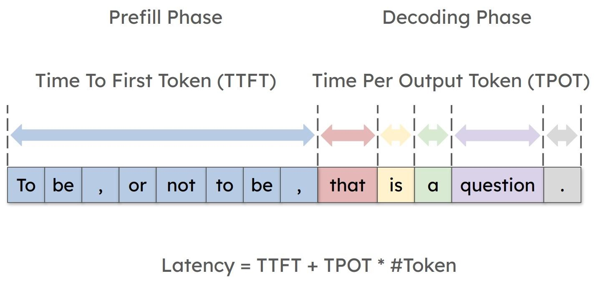
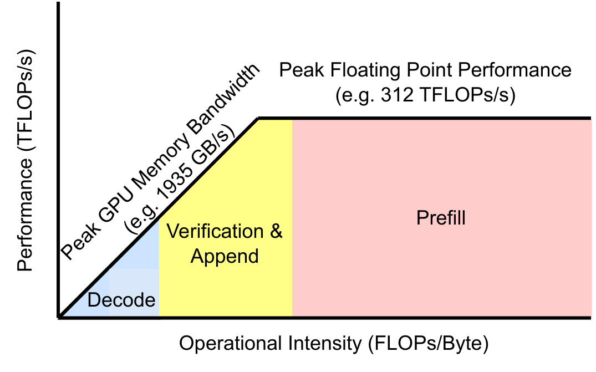

### What Are Prefill and Decode?

In LLM inference, prefill and decode are two distinct phases of text generation: 
- **Prefill phase** is the first forward pass through the model, where the **entire prompt** (all user input tokens) is processed. It builds the **initial KV cache**. It's also called **Context Encoding or CTE**.
- **Decode phase** produces **one new token at a time** (or a few tokens in parallel if speculative/parallel decoding is used). At each step, it uses the KV from the prefill, only calculates the attention on the newest token, and extend the KV cache. It's also called **Token Generation, tokengen, or TKG**.

(The backward pass only appears in training, not inference...!)

### Prefill and Decode Have Different Performance Characteristics

- Prefill processes the entire prompt in parallel, so the GPU spends most of its time on large matrix multiplications. This makes it **compute-bound**.
- Decode generates one token at a time, so each step does a matrix-vector multiplication and does relatively little compute, but it repeatedly reads model weights and KV cache from memory. This makes it **memory-bound**.

The roofline diagrams below illustrate the different bottlenecks of prefill and decode. [^1]

### Batching

Why prefills and/or decode from different requests can be execute at the same time on a GPU? Batching is handled by the inference server (scheduler), which aggregates multiple requests into a single tensor before launching one large GEMM on the GPU. The GPU is unaware of individual requests; it only executes the combined matrix operation.

In a Transformer, the computation is essentially:
- Prefill: `[B, L, d] x [d, d]`
- Decode (single step):`[B, 1, d] x [d, d]`

Here, `B` (batch size) is the number of concurrent requests. `L` is sequence length and `d` is hidden dimension.

Why can the prefill batch not be too large? Or equivalently, why can prefill concurrency not be too high? Because `L` is large for prefill. Compute already saturates the tensor cores, and memory usage also grows quickly due to activations and KV cache.

Why can decode support higher concurrency?
Decode uses `[B, 1, d] x [d, d]`. Since `L` does not appear in the computation, the compute per step is much smaller.

[^1]: Introducing FlashInfer: A Library and Kernel Generator for LLM Serving. FlashInfer. <https://flashinfer.ai/2024/02/02/introduce-flashinfer.html>
