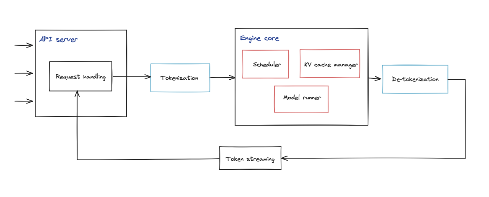

How would we design an LLM inference serving system that supports multi-request concurrency, low latency, and high throughput? Such a system introduces a new set of systems challenges:
- How do we achieve low latency and high throughput when many user requests arrive concurrently?
- What should we do when the model is too large and the KV cache exceeds GPU memory capacity?
- How can we schedule GPU resources efficiently across many users and many models?

This section discusses the main challenges above in the context of inference serving systems. The focus is on how modern servers handle concurrency, memory pressure, and scheduling efficiency in practice.

### vLLM

For simplicity, we use nano-vLLM as the example here [^1]. Its key components are:
1. `LLM Engine`: The top-level orchestration component of the inference service. It initializes the modules required for serving, exposes the request interface (generate), and coordinates the full request lifecycle, including input processing/encoding, scheduling, model execution, and output decoding.
2. `Scheduler`: Maintains pending requests through queues, organizes them, and dispatches the requests that need to be executed at each step.
3. `Model Runner`: Loads and runs the model, performing computation for each request. When `TP > 1`, the main process launches multiple `Model Runner` instances to jointly complete the forward pass.
4. `Block Manager`: Manages the GPU memory used for the KV cache based on PagedAttention.

**LLM Engine** 

LLM Engine is the core module of the inference framework. It creates one `Scheduler` instance and at least one `Model Runner` instance. Its main logic is encapsulated in the `generate` function, with data passed between modules through function arguments.

The process can be described as follows:

1. After receiving a user request, it uses the tokenizer to encode the prompt into token IDs and calls `add_request` to create a `Sequence` instance for each request.
2. It then calls `step`, which triggers the scheduler and lets it pass the pending request data to the `Model Runner`.
3. Finally, it decodes the token IDs into text and returns the result to the user, while the scheduler releases the corresponding resources.

Use tighter versions like these.

**Scheduler**

Scheduler is the component responsible for request scheduling and execution orchestration. It maintains two queues, `waiting` and `running`, and moves requests between them during execution. The default **policy** is `prefill`-first to reduce time to first token. During `decode`, if KV cache blocks are insufficient, it **preempts** later-admitted requests in `running` and moves them back to `waiting`. This design **prioritizes** admission latency and KV-cache feasibility over strict fairness. It also creates a `Block Manager` instance to manage KV cache blocks.

The process can be described as follows:

1. New requests are added to the `waiting` queue.
2. For runnable requests, it allocates the required KV cache blocks and records the mappings in the `block table`.
3. Scheduling proceeds in two stages, `prefill` and `decode`, with `prefill` prioritized by default.
4. After execution, it updates request states and releases KV cache resources for finished requests.
5. The generated results are returned to the upper-layer module for decoding.

**Model Runner**

Model Runner is the component responsible for model execution, including input preparation, forward passes, and sampling. When `TP > 1`, different ranks coordinate through `multiprocessing`, `SharedMemory`, and distributed communication. Rank 0 receives execution requests from the scheduler and shares the invocation data with other ranks. All ranks participate in the forward pass, but only rank 0 performs sampling and returns the final `token ids`. Its main execution entry point is `run()`.

The process can be described as follows:

1. At service startup, it loads model weights, performs warmup, allocates KV cache, and optionally captures CUDA Graphs.
2. Rank 0 receives runnable requests from the scheduler.
3. When `TP > 1`, rank 0 writes the invocation data into `SharedMemory`, and other ranks read it in `loop()` and execute the same method.
4. `run()` prepares the inputs for either `prefill` or `decode` and builds the required attention context.
5. `run_model()` performs the forward pass, and rank 0 samples from the resulting `logits` to produce `token ids`.

**Block Manager**

Block Manager manages KV cache blocks in GPU memory. It maintains the global block pool, tracks free and used blocks, and records each request’s block mappings in the `block table`. Following the PagedAttention design, it allocates KV cache in fixed-size blocks and supports prefix cache reuse through block hashing and reference counting.

The process can be described as follows:

1. When a request enters `prefill`, it checks whether enough KV cache blocks are available.
2. It allocates the required blocks and records them in the request’s `block table`; cached prefix blocks may be reused when available.
3. During `decode`, it checks whether the request can append new tokens and allocates a new block if needed.
4. It maintains reference counts for shared cached blocks.
5. When a request finishes or is preempted, it releases the corresponding blocks and returns unused blocks to the free pool.

**vLLM v.s. SGLang**

vLLM maximizes per-request efficiency with PagedAttention (memory paging for KV cache), while SGLang maximizes cross-request reuse via prefix sharing (radix tree KV cache).
In practice: SGLang wins on prefix-heavy workloads (chat/RAG), while vLLM is more general-purpose and production-ready; both are otherwise converging in performance.

### From Triton to Dynamo

Nvidia **Triton** Inference Server is a production framework for serving machine learning and deep learning models through HTTP/REST and gRPC. Instead of building your own model service with something like Flask, you can let Triton handle model loading, batching, and request scheduling. It was originally called TensorRT Inference Server, but later expanded to support many backends rather than only TensorRT. Because the server is decoupled from the backend, it can serve TensorRT, ONNX Runtime, PyTorch, TensorFlow, Python, and custom backends under one framework. Triton runs on CPU, single-GPU, and multi-GPU systems, so it fits many deployment setups. Beyond basic serving, its key features include dynamic batching, concurrent model execution, model repository management, ensemble pipelines, and metrics and health endpoints. [^3]

Nvidia **Dynamo** is the next generation of inference servers than Triton. It supports several backends: TensorRT-LLM, vLLM, and SGLang. One of its main advantages is PD disaggregation, which separates different stages of inference work so the system can schedule them more efficiently. It also uses a prefix-aware router, which sends each request to a worker whose prefix cache is more likely to be useful. This helps improve cache reuse and reduces redundant computation. Another important feature is KV cache offloading, which makes memory usage more flexible under heavy serving load. For KV cache transfer, Dynamo uses **NIXL**, a high-speed communication library that can automatically choose between NVLink and RDMA depending on the hardware path. [^4] [^5]

Its implementation in Rust is also notable, because Rust generally offers better memory management than C++ and better performance characteristics than Python, which fits the broader industry trend toward safer high-performance systems.

### Mooncake
https://zhuanlan.zhihu.com/p/705754254
https://zhuanlan.zhihu.com/p/706097807

[^1]: Nano-vLLM <https://github.com/GeeeekExplorer/nano-vllm>
[^2]: Aleksa Gordic, "Inside vLLM: Anatomy of a High-Throughput LLM Inference System" <https://www.aleksagordic.com/blog/vllm>
[^3]: Nvidia Triton Inference Server <https://github.com/triton-inference-server>
[^4]: Nvidia Dynamo <https://github.com/ai-dynamo/dynamo>
[^5]: Nvidia NIXL <https://github.com/ai-dynamo/nixl?tab=readme-ov-file>
