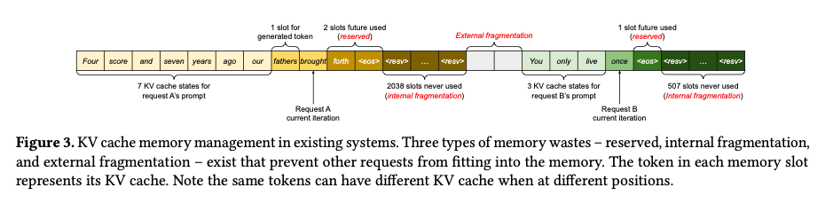

### vLLM v.s. SGLang

vLLM maximizes per-request efficiency with PagedAttention (memory paging for KV cache), while SGLang maximizes cross-request reuse via prefix sharing (radix tree KV cache).
In practice: SGLang wins on prefix-heavy workloads (chat/RAG), while vLLM is more general-purpose and production-ready; both are otherwise converging in performance.

### Paged Attention (vLLM)

Inference servers handle live traffic rather than a static batch job, so requests can have very different token lengths. This creates a challenge for KV cache allocation. A naive approach is to reserve a fixed-size buffer for the maximum token length for every request. Since each request has a different input length, much of that allocated memory remains unused.

PagedAttention is a memory management system for KV cache designed to solve this problem [^1]. Instead of allocating one large contiguous buffer, it divides the KV cache into fixed-size blocks ("pages"). Each request's KV cache is then represented as a linked list of blocks. This reduces fragmentation and makes allocation more flexible and efficient.

This is analogous to OS virtual memory:

| OS concept                 | vLLM equivalent                           |
| -------------------------- | ----------------------------------------- |
| Virtual page               | Logical KV block                          |
| Physical page              | Physical KV cache block in GPU memory     |
| Page table                 | Block table mapping logical to physical blocks |
| Memory allocator           | KV cache manager / block allocator        |

### Continuous Batching

Traditional static batching has to wait until all requests in a batch finish before processing the next batch, which causes earlier-finished requests to sit idle.
Continuous batching is a special case of dynamic batching and one of the main reasons vLLM outperforms older serving engines. It can *add new requests to an active batch* while removing finished ones at the same time. With PagedAttention, each request's KV cache is managed independently, so adding or removing requests does not disrupt the memory layout [^2].



### Speculative Decoding

(这章写的不走心啊！)

In normal decoding, each new token requires a full forward pass through the large LLM. This is expensive, especially for long generations. Speculative decoding uses a small, fast draft model to propose several tokens ahead, and then the large target model verifies them in parallel [^3] [^4].

### Chunked prefill
(这章也写的不走心啊！)

When prompts are long, the prefill phase can monopolize GPU compute and delay decode-heavy traffic. Chunked prefill addresses this by splitting a long prefill into equal-sized chunks and scheduling those chunks alongside decode requests [^5].

The key idea is to form hybrid batches: one prefill chunk keeps the GPU compute-saturated, while decode requests piggyback in the remaining slots. This improves utilization, reduces pipeline bubbles, and lowers tail latency compared with running large prefills as a single monolithic step.

[^1]: Efficient Memory Management for Large Language Model Serving with PagedAttention. arXiv, September 12, 2023. <https://arxiv.org/abs/2309.06180>
[^2]: How continuous batching enables 23x throughput in LLM inference while reducing p50 latency. June 22, 2023. <https://www.anyscale.com/blog/continuous-batching-llm-inference>
[^3]: Fast Inference from Transformers via Speculative Decoding. arXiv, November 30, 2022. <https://arxiv.org/abs/2211.17192>
[^4]: Accelerating Large Language Model Decoding with Speculative Sampling. arXiv, February 2, 2023. <https://arxiv.org/abs/2302.01318>
[^5]: Amey Agrawal, Ashish Panwar, Jayashree Mohan, Nipun Kwatra, Bhargav S. Gulavani, and Ramachandran Ramjee. SARATHI: Efficient LLM Inference by Piggybacking Decodes with Chunked Prefills. arXiv, August 31, 2023. <https://arxiv.org/abs/2308.16369>
