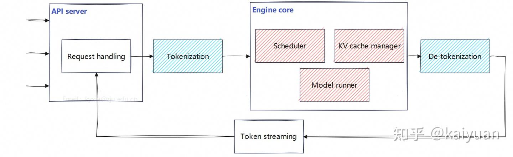

How would we design an LLM inference serving system that supports multi-request concurrency, low latency, and high throughput? Such a system introduces a new set of systems challenges:
- How do we achieve low latency and high throughput when many user requests arrive concurrently?
- What should we do when the model is too large and the KV cache exceeds GPU memory capacity?
- How can we schedule GPU resources efficiently across many users and many models?

This section discusses the main challenges above in the context of inference serving systems. The focus is on how modern servers handle concurrency, memory pressure, and scheduling efficiency in practice.

### vLLM

For simplicity, we use nano-vLLM as the example here [^1]. Its key components are:
1. `LLM Engine`: The top-level orchestration component of the inference service. It initializes the modules required for serving, exposes the request interface (generate), and coordinates the full request lifecycle, including input processing/encoding, scheduling, model execution, and output decoding.
2. `Scheduler`: Maintains pending requests through queues, organizes them, and dispatches the requests that need to be executed at each step.
3. `Model Runner`: Loads and runs the model, performing computation for each request. When `TP > 1`, the main process launches multiple `Model Runner` instances to jointly complete the forward pass.
4. `Block Manager`: Manages the GPU memory used for the KV cache based on PagedAttention.

**LLM Engine** 

LLM Engine is the core module of the inference framework. It creates one `Scheduler` instance and at least one `Model Runner` instance. Its main logic is encapsulated in the `generate` function, with data passed between modules through function arguments.

The process can be described as follows:

1. After receiving a user request, it uses the tokenizer to encode the prompt into token IDs and calls `add_request` to create a `Sequence` instance for each request.
2. It then calls `step`, which triggers the scheduler and lets it pass the pending request data to the `Model Runner`.
3. Finally, it decodes the token IDs into text and returns the result to the user, while the scheduler releases the corresponding resources.

Use tighter versions like these.

**Scheduler**

Scheduler is the component responsible for request scheduling and execution orchestration. It maintains two queues, `waiting` and `running`, and moves requests between them during execution. The default **policy** is `prefill`-first to reduce time to first token. During `decode`, if KV cache blocks are insufficient, it **preempts** later-admitted requests in `running` and moves them back to `waiting`. This design **prioritizes** admission latency and KV-cache feasibility over strict fairness. It also creates a `Block Manager` instance to manage KV cache blocks.

The process can be described as follows:

1. New requests are added to the `waiting` queue.
2. For runnable requests, it allocates the required KV cache blocks and records the mappings in the `block table`.
3. Scheduling proceeds in two stages, `prefill` and `decode`, with `prefill` prioritized by default.
4. After execution, it updates request states and releases KV cache resources for finished requests.
5. The generated results are returned to the upper-layer module for decoding.

**Model Runner**

Model Runner is the component responsible for model execution, including input preparation, forward passes, and sampling. When `TP > 1`, different ranks coordinate through `multiprocessing`, `SharedMemory`, and distributed communication. Rank 0 receives execution requests from the scheduler and shares the invocation data with other ranks. All ranks participate in the forward pass, but only rank 0 performs sampling and returns the final `token ids`. Its main execution entry point is `run()`.

The process can be described as follows:

1. At service startup, it loads model weights, performs warmup, allocates KV cache, and optionally captures CUDA Graphs.
2. Rank 0 receives runnable requests from the scheduler.
3. When `TP > 1`, rank 0 writes the invocation data into `SharedMemory`, and other ranks read it in `loop()` and execute the same method.
4. `run()` prepares the inputs for either `prefill` or `decode` and builds the required attention context.
5. `run_model()` performs the forward pass, and rank 0 samples from the resulting `logits` to produce `token ids`.

**Block Manager**

Block Manager manages KV cache blocks in GPU memory. It maintains the global block pool, tracks free and used blocks, and records each request’s block mappings in the `block table`. Following the PagedAttention design, it allocates KV cache in fixed-size blocks and supports prefix cache reuse through block hashing and reference counting.

The process can be described as follows:

1. When a request enters `prefill`, it checks whether enough KV cache blocks are available.
2. It allocates the required blocks and records them in the request’s `block table`; cached prefix blocks may be reused when available.
3. During `decode`, it checks whether the request can append new tokens and allocates a new block if needed.
4. It maintains reference counts for shared cached blocks.
5. When a request finishes or is preempted, it releases the corresponding blocks and returns unused blocks to the free pool.

**vLLM v.s. SGLang**

vLLM maximizes per-request efficiency with PagedAttention (memory paging for KV cache), while SGLang maximizes cross-request reuse via prefix sharing (radix tree KV cache).
In practice: SGLang wins on prefix-heavy workloads (chat/RAG), while vLLM is more general-purpose and production-ready; both are otherwise converging in performance.

**Other Inference Servers**

Beyond vLLM and SGLang, systems such as **Fireworks AI** and **NVIDIA Dynamo** also target high-throughput LLM serving. They focus on the same core problems: request scheduling, KV-cache management, batching, and multi-GPU execution. The main differences are in system design, optimization priorities, and how tightly they integrate with production infrastructure.

### Memory Bandwidth Bottlenecks

Many people wonder: GPUs today have extremely high compute capability, so why is inference still slow? In most inference cases, the primary bottleneck is not compute (FLOPs), but **memory bandwidth**—how fast data can be read from GPU memory.

**Performance Metrics**

Inference performance is primarily determined by two interrelated and often competing metrics: **throughput** and **latency**.

1. **Throughput** measures the total amount of work a system can process per unit time. In large model systems, it is typically expressed as **tokens per second (tokens/s)**. It reflects overall system capacity and directly impacts cost: the more tokens generated within the same time window, the lower the cost per token.

2. **Latency** measures the response time for a single request and can be further decomposed into two key metrics. **Time to First Token (TTFT)** is the time from request arrival to the first generated token, determining perceived responsiveness. **Time per Output Token (TPOT)** is the average time to generate each subsequent token, determining the effective generation speed.

Throughput and latency are inherently in tension. Improving throughput (e.g., via batching) often increases latency, while optimizing latency may reduce system utilization and increase cost. The key mechanism to balance this tradeoff is **concurrency**, which, through scheduling and resource management, mediates between cost efficiency and service quality (SLA).

Besides, **fault tolerance** is another nontrivial serving challenge. In a distributed LLM system, failures can occur at the GPU, host, interconnect, or rack level during live traffic. Because modern serving stacks schedule work at mixed granularities such as requests, groups, and tokens, they must preserve runtime state and recover quickly. Memory management is part of the same problem: some models fit at load time but still hit OOM on long sequences without robust runtime safeguards.

**1. Single Request**

Large language models use autoregressive decoding, generating one token at a time. For each token, the GPU must stream essentially the entire model weights from HBM into GPU. This creates a hard upper bound on generation speed:

max token/s ≈ memory bandwidth / model size

For example, a 32B parameter model with 4-bit quantization occupies about 18GB in memory. On a GPU with 900 GB/s bandwidth, the theoretical limit is:

900 / 18 ≈ 50 tokens per second

In reality, additional overheads such as KV cache access and other system overheads further reduce this number.

**2. Concurrent Requests**

Since single-request latency is bounded by bandwidth, we can improve utilization via **batching**. Instead of serving one request at a time, the system aggregates multiple requests and processes them together.

The model weights are still loaded once per step, but now produce tokens for multiple sequences simultaneously. This does not reduce latency for an individual request. In fact, queuing may slightly increase it—but it significantly improves overall throughput and cost efficiency. See [Continuous Batching](/llm/inference_4_other_optimizations/#continuous-batching).

In the same example, the system still needs to load the 18 GB model only once, but it can compute the next token for several users at the same time. As another example, one Wallstreetcn news estimates that a single H20 can support about 500 concurrent users of the full DeepSeek model on WeChat. At that scale, 100,000 to 200,000 H20s would support roughly 50 million to 100 million concurrent users [^2].

**3. Mixture of Experts (MoE)**

Another approach is to reduce the amount of data moved per step. Mixture of Experts (MoE) architectures activate only a subset of parameters for each token.

Instead of loading the full 32B model, only a fraction (e.g., 8B) is used per step. This reduces memory traffic proportionally. In the same example, the effective data movement drops to ~4.5GB, increasing the theoretical throughput to:

900 / 4.5 ≈ 200 tokens per second

**4. Speculative Decoding**

Speculative decoding changes the computation pattern itself. Instead of generating one token per forward pass, a small, fast model first predicts multiple tokens. The large model then verifies these predictions in a single pass. If the predictions are correct, one expensive memory load yields multiple tokens. This effectively increases tokens produced per unit of memory bandwidth, improving single-user latency without changing hardware. See [Speculative Decoding](/llm/inference_4_other_optimizations/#speculative-decoding).

For example, the 18 GB model is loaded just once, to verify whether all tokens generated by the small model are correct at the same time. 

**5. Specialized Hardware**

A more radical direction is to eliminate the memory bottleneck at the hardware level.

One approach places the entire model in on-chip SRAM, avoiding external memory access entirely, like Groq and Cerebras. Since SRAM bandwidth is orders of magnitude higher than HBM, this can dramatically increase token generation speed, albeit at high cost and limited capacity. 

An even more extreme approach compiles model weights directly into hardware circuits, like Taalas. In this design, computation becomes signal propagation through fixed wiring, with no concept of memory reads. Fully pipelined execution allows extremely high throughput (on the order of tens of thousands of tokens per second) and low power consumption, but the chip becomes immutable after fabrication.

### Memory Capacity Bottlenecks

Though most LLM inference is bounded by memory bandwidth, some scenarios are bounded by memory capacity. Memory bandwidth limits speed. Memory capacity limits feasibility. If the KV cache for long sequences or many concurrent requests does not fit, you get OOM or have to evict/preempt requests.

Common strategies to reduce memory capacity overhead in LLM inference are mostly about shrinking or managing the **KV cache**, since that is usually the dominant runtime memory consumer. See backround in [KV Cache](/llm/inference_1_kv_cache).

System-level optimizations:
1. Paged/block-based KV allocation. Systems like vLLM's PagedAttention allocate fixed-size blocks instead of large contiguous buffers, which reduces fragmentation and wasted space.
2. Prefix cache reuse. Reuse KV blocks for requests with the same prompt prefix, often with copy-on-write, such as SGLang.
3. Chunked prefill. Split very long prompts into smaller chunks to avoid large temporary peaks during prefill.
4. Reduce concurrency or max context length. This is the simplest operational control when memory is the limiting factor.
5. KV eviction/offloading. Move cold KV blocks to CPU memory or evict lower-priority requests when GPU memory is tight.

Model-level optimizations:
1. Use MQA/GQA. Multi-Query Attention or Grouped-Query Attention reduces KV size by sharing keys/values across heads.
2. Sliding-window or local attention. Keep only a recent window of tokens instead of the full history, when the model architecture supports it.

Numerical-level optimizations:
1. Quantize the KV cache. Store KV in lower precision such as `FP8` or `INT8` instead of `FP16`/`BF16`.

[^1]: Nano-vLLM <https://github.com/GeeeekExplorer/nano-vllm>
[^2]: https://wallstreetcn.com/articles/3741189
