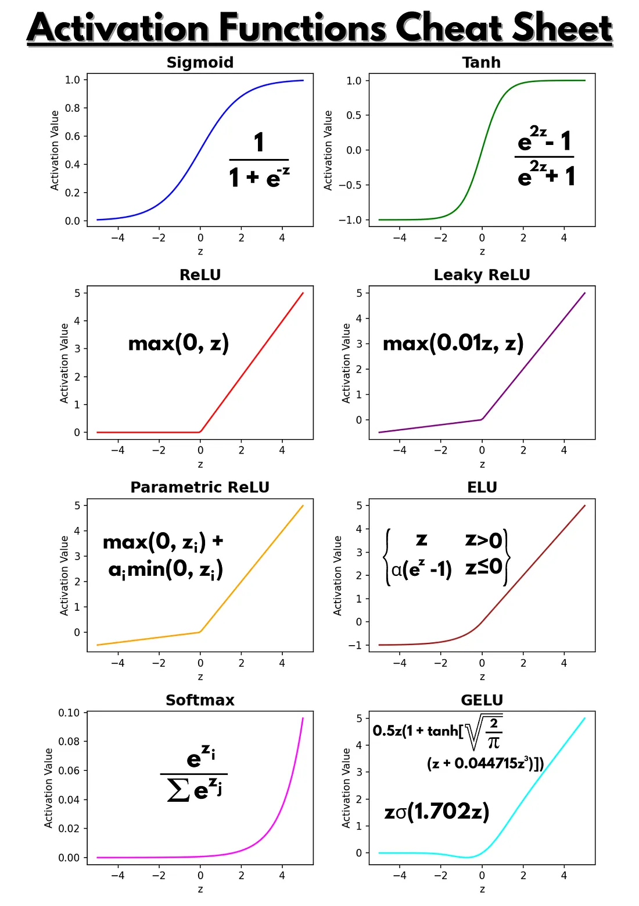

This post is a compact set of notes on the math and statistics foundations behind machine learning and deep learning, which I collected over the past few years.

### Table of Contents

- [Basic Terms](#basic-terms)
- [Training Workflow](#training-workflow)
- [Inference Workflow](#inference-workflow)
- [Basic ML Algorithms](#basic-ml-algorithms)
- [Chain Rule, Backpropagation, and Forward/Backward Passes](#chain-rule-backpropagation-and-forwardbackward-passes)
- [Evaluation Metrics](#evaluation-metrics)
- [Overfitting and Regularization](#overfitting-and-regularization)
- [Bias, Variance, and Cross-Validation](#bias-variance-and-cross-validation)
- [Loss and Optimizer](#loss-and-optimizer)
- [Activation Functions](#activation-functions)
- [Normalization](#normalization)
- [Probability and Statistics for Machine Learning](#probability-and-statistics-for-machine-learning)
- [Uncategorized](#uncategorized)

### Basic Terms

Machine learning usually starts with a model, a loss function, gradients, and an optimizer.

| Term | Meaning | Math | PyTorch Keyword |
| --- | --- | --- | --- |
| **Model** | Function mapping $x \to \hat{y}$ | $f_\theta(x)$ | `nn.Module` |
| **Parameters** | What the model learns. Include weight and bias | $\theta = \{w, b\}$ | `model.parameters()` |
| **Loss function** | Error measure | $L(y, \hat{y}) = \frac{1}{N}\sum_i (\hat{y}_i - y_i)^2$ | `nn.MSELoss`, `nn.CrossEntropyLoss` |
| **Gradient** | Derivative of the loss with respect to parameters | $\nabla_\theta L$ | `loss.backward()` |
| **Optimizer** | Updates parameters | $\theta \leftarrow \theta - \eta\nabla_\theta L$ | `torch.optim.SGD` |

### Training Workflow

**Forward -> Backward -> Optimizer**: A typical training iteration contains a forward pass to generate **losses** from inputs and labels, a backward pass to compute **gradients** for parameters, and an optimizer step to **update parameters** using those gradients.
1. Forward pass: 
    - Compute predictions $\hat{y}=f_\theta(x)$
    - Compute loss: compare $\hat{y}$ with the true $y$.
    - Activations are computed as intermediate results inside the forward pass.
2. Backward pass: 
    - Compute gradients $\nabla_\theta L$.
    - The backward pass appears only during training, not during inference.
3. Optimizer step:
    - update weights.
4. Repeat the above over many epochs.

Typical dataset split: training set: 70-80%; validation set: 10-15%; test set: 10-15%.

A sample PyTorch code:

```python
import torch
import torch.nn as nn
from torch.utils.data import DataLoader, TensorDataset

device = torch.device("cuda" if torch.cuda.is_available() else "cpu")
train_data = torch.randn(256, 1, 28, 28)
train_labels = torch.randint(0, 10, (256,))
train_loader = DataLoader(TensorDataset(train_data, train_labels), batch_size=32, shuffle=True)

model = nn.Sequential(
    nn.Flatten(),
    nn.Linear(28 * 28, 128),
    nn.ReLU(),  # Activation function
    nn.Linear(128, 10),
).to(device)

loss_fn = nn.CrossEntropyLoss() # loss function
optimizer = torch.optim.Adam(model.parameters(), lr=1e-3)
num_epochs = 3

model.train()

for epoch in range(num_epochs):
    total_loss = 0

    for images, labels in train_loader:
        images, labels = images.to(device), labels.to(device)

        # Forward pass: 
        #               compute predictions; activations happen inside model(...)
        outputs = model(images)
        #               compute loss and compare predictions with labels
        loss = loss_fn(outputs, labels)

        # Backward pass: 
        #               clear old gradients, then compute new gradients
        optimizer.zero_grad()
        loss.backward()

        # Optimizer to update weights
        optimizer.step()

        total_loss += loss.item()

    avg_loss = total_loss / len(train_loader)
    print(f"Epoch {epoch+1}/{num_epochs}, Loss: {avg_loss:.4f}")
```

### Inference Workflow

A typical inference iteration looks like this:

1. Load the **trained model** and switch it to evaluation mode.
2. Preprocess the **input data** using the same transformations used during training.
3. Run the **forward pass** to compute predictions.
4. Postprocess the **model output** into the final label, score, or generated result.
5. Return the result without updating weights or gradients (no backward pass).

A sample PyTorch code:

```python
# (Reuse the trained model and device from the training example above)
test_data = torch.randn(64, 1, 28, 28)
test_loader = DataLoader(TensorDataset(test_data), batch_size=32)

# Inference: switch to evaluation mode
model.eval()

# Inference: no backward pass or weight updates
with torch.no_grad():
    for (images,) in test_loader:
        images = images.to(device)

        # Forward pass: compute predictions
        outputs = model(images)
        # Postprocess: convert logits to predicted classes
        predictions = torch.argmax(outputs, dim=1)
```

### Basic ML Algorithms

| Algorithm | Type / Task | Core Idea | Key Equation |
| --- | --- | --- | --- |
| **Linear Regression** | Supervised regression | Fit a linear function by minimizing MSE | $\hat{y} = \mathbf{w}^{\top}\mathbf{x} + b$ |
| **Logistic Regression** | Supervised classification | Map logits to probability with a sigmoid and optimize cross-entropy | $p = \sigma(\mathbf{w}^{\top}\mathbf{x} + b)$ |
| **Naive Bayes** | Supervised classification | Bayes rule with conditional independence assumptions | $\hat{c} = \arg\max_{c \in \mathcal{C}} \log P(c) + \sum_j \log P(x_j \mid c)$ |
| **K-Nearest Neighbors** | Supervised classification / regression | Predict from nearby examples | $d(\mathbf{x}, \mathbf{x}') = \sqrt{\sum_j (x_j - x'_j)^2}$ |
| **K-Means** | Unsupervised clustering | Alternate between assignment and centroid update | $\min \sum_{i=1}^{N}\sum_{k=1}^{K} r_{ik}\|\mathbf{x}_i - \mu_k\|^2$ |
| **Decision Tree** | Supervised classification / regression | Greedy splits that reduce impurity | $H(S) = -\sum_c p_c \log_2 p_c$ or $G(S)=1-\sum_c p_c^2$ |
| **Random Forest** | Ensemble classification / regression | Aggregate many trees trained on resampled data | $\hat{y} = \mathrm{mode}\{f_t(\mathbf{x})\}$ or $\hat{y} = \frac{1}{T}\sum_t f_t(\mathbf{x})$ |
| **XGBoost** | Gradient-boosted trees | Add trees stage by stage to fit residuals | additive boosting objective |


### Chain Rule, Backpropagation, and Forward/Backward Passes

**Chain rule**

- The mathematical core of deep learning is the **chain rule**, which finds the derivative of a *composite function*.
- For a 1D composite function:
  - Given $y=f(g(x)) = f(u), u=g(x)$, then $\frac{dy}{dx} = \frac{du}{dy}\cdot\frac{dx}{du}$
  - Example: given $y = \sin(3x)$, then $\frac{dy}{dx} = \frac{d}{du}\sin(u) \cdot \frac{d}{dx}3x = \cos(u) \cdot 3 = 3\cos(3x)$
- For a 2D composite function:
  - Given $z=f(x,y)$, where $x=g(t), y=h(t)$, then $\frac{dz}{dt} = \frac{\partial f}{\partial x}\cdot\frac{dx}{dt} + \frac{\partial f}{\partial y}\cdot\frac{dy}{dt}$
  - Example: given $z=x^2y+3y, x=t^2, y=\sin(t)$, then $\frac{dz}{dt} = \frac{\partial}{\partial x}(x^2y+3y) \cdot \frac{d}{dt}t^2 + \frac{\partial}{\partial y}(x^2y+3y) \cdot \frac{d}{dt}\sin(t) = 2xy \cdot 2t + (x^2 + 3)\cdot \cos(t)$
- Now, for **multivariable** functions, the same idea becomes the **Jacobian chain rule**:
  - Given $\mathbf{y}=f(\mathbf{u}), \mathbf{u}=g(\mathbf{x})$, that is, $\mathbf{y}=f(g(\mathbf{x}))$, the derivative with respect to $\mathbf{x}$ is given by the Jacobian chain rule: $J_{f\circ g}=J_f\cdot J_g$, where $J_f = \frac{\partial u}{\partial y}$ and $J_f = \frac{\partial u}{\partial x}$
  - Jacobian matrix: $J_f = \begin{bmatrix}\frac{\partial y_1}{\partial x_1} & \frac{\partial y_1}{\partial x_2} & \cdots & \frac{\partial y_1}{\partial x_n} \\\\ \frac{\partial y_2}{\partial x_1} & \frac{\partial y_2}{\partial x_2} & \cdots & \frac{\partial y_2}{\partial x_n} \\\\ \vdots & \vdots & \ddots & \vdots \\\\ \frac{\partial y_m}{\partial x_1} & \frac{\partial y_m}{\partial x_2} & \cdots & \frac{\partial y_m}{\partial x_n}\end{bmatrix}$

**Forward and Backward Passes**

1. You can think of the forward pass as: "Compute outputs layer by layer."
2. You can think of the backward pass, or backpropagation, as: "Propagate the loss backward using the chain rule."

**Backpropagation**

It uses the chain rule to calculate the gradient of the loss function

mathematically speaking
1. It uses the chain rule to calculate the gradient: $\frac{\partial \mathcal{L}}{\partial w} =
    \frac{\partial \mathcal{L}}{\partial a_L}
    \cdot
    \frac{\partial a_L}{\partial a_{L-1}}
    \cdot
    \dots
    \cdot
    \frac{\partial a_1}{\partial w}$
2. It reuses intermediate results to compute gradients efficiently, in a dynamic-programming style.
3. Those gradients are then used to update weights through gradient descent: $w \leftarrow w - \eta \frac{\partial \mathcal{L}}{\partial w}$

I recommend reading this Chinese PDF: [backprop.pdf](./backprop.pdf)

### Evaluation Metrics

Different tasks require different metrics:

| Category | Typical Tasks | Key Metric(s) |
| --- | --- | --- |
| **Regression** | Forecasting, numeric prediction | MAE, MSE, RMSE, $R^2$ |
| **Binary Classification** | Spam detection, fraud detection | Accuracy, F1, ROC-AUC, Log-Loss |
| **Multiclass Classification** | Image classification | Macro-F1, Micro-F1, Cross-Entropy |
| **Imbalanced Data** | Rare disease, anomaly detection | PR-AUC, Recall, $F_\beta$ |
| **Ranking / Recommendation** | Search, recommendation systems | nDCG, Recall@k, MAP |


**Statistical Foundations**

| Concept | Description |
| --- | --- |
| **Expectation (Mean)** | $E[X] = \sum x_i p(x_i)$ or $\int x p(x) dx$. Many metrics, such as MAE and MSE, are expectations of loss functions over the data distribution. |
| **Variance** | $Var[X] = E[(X - E[X])^2]$. MSE includes variance and squared bias components. |
| **Bias-Variance Decomposition** | $E[(y - \hat{y})^2] = \text{Bias}^2 + \text{Variance} + \text{Noise}$. This explains the tradeoff in model complexity. |
| **Likelihood & Cross-Entropy** | Cross-entropy is the negative log-likelihood; minimizing it is equivalent to maximizing likelihood. |
| **Ranking Metrics & Information Theory** | nDCG is derived from information gain; the log base 2 term simulates diminishing user attention. |

**Regression Metrics**

| Metric | Formula | Meaning | Range |
| --- | --- | --- | --- |
| **Mean Squared Error (MSE)** | $\text{MSE} = \frac{1}{n}\sum_{i=1}^n (y_i - \hat{y}_i)^2$ | Penalizes large errors more heavily; sensitive to outliers | $[0, \infty)$ |
| **Mean Absolute Error (MAE)** | $\text{MAE} = \frac{1}{n}\sum_{i=1}^n \|y_i - \hat{y}_i\|$ | Average absolute error; easier to interpret | $[0, \infty)$ |
| **Root Mean Squared Error (RMSE)** | $\text{RMSE} = \sqrt{\text{MSE}}$ | Same unit as the target | $[0, \infty)$ |
| **Coefficient of Determination ($R^2$)** | $R^2 = 1 - \frac{\sum (y_i - \hat{y}_i)^2}{\sum (y_i - \bar{y})^2}$ | Fraction of variance explained by the model | $(-\infty, 1]$ |
| **Adjusted $R^2$** | $1 - (1 - R^2)\frac{n-1}{n-p-1}$ | Penalizes adding too many variables | $(-\infty, 1]$ |

**Classification Metrics**

| Metric | Formula | Meaning | Range |
| --- | --- | --- | --- |
| **Accuracy** | $\frac{TP + TN}{TP + TN + FP + FN}$ | Fraction of all predictions that are correct | $[0, 1]$ |
| **Precision** | $\frac{TP}{TP + FP}$ | Of predicted positives, how many are correct | $[0, 1]$ |
| **Recall** | $\frac{TP}{TP + FN}$ | Of true positives, how many are found | $[0, 1]$ |
| **F1-score** | $2 \cdot \frac{\text{Precision}\cdot\text{Recall}}{\text{Precision} + \text{Recall}}$ | Harmonic mean of precision and recall | $[0, 1]$ |
| **Specificity** | $\frac{TN}{TN + FP}$ | True negative rate | $[0, 1]$ |
| **Balanced Accuracy** | $\frac{1}{2}(\text{TPR} + \text{TNR})$ | Useful for imbalanced classes | $[0, 1]$ |

**Probabilistic Classification Metrics**

| Metric | Formula | Meaning |
| --- | --- | --- |
| **Cross-Entropy (Log Loss)** | $-\frac{1}{n} \sum_i [ y_i \log \hat{p}_i + (1-y_i)\log(1-\hat{p}_i) ]$ | Measures how close predicted probabilities are to labels |
| **AUC-ROC (Area Under the ROC Curve)** | $\int_0^1 \text{TPR}(\text{FPR})\, d(\text{FPR})$ | Probability a random positive is ranked above a random negative |
| **Average Precision (AP)** | $\text{AP} = \sum_n (R_n - R_{n-1}) P_n$ | Area under the precision-recall curve |

**Ranking & Recommendation Metrics**

| Metric | Formula | Meaning | Range |
| --- | --- | --- | --- |
| **Recall@k** | $\text{Recall@k} = \frac{\text{\# relevant items in top k}}{\text{total relevant items}}$ | Fraction of relevant items retrieved in top-k | $[0, 1]$ |
| **Precision@k** | $\frac{\#\{\text{relevant items in top } k\}}{k}$ | Fraction of top-k items that are relevant | $[0, 1]$ |
| **nDCG@k (Normalized Discounted Cumulative Gain)** | $\frac{\mathrm{DCG}@k}{\mathrm{IDCG}@k}$ where $\mathrm{DCG}@k = \sum_{i=1}^{k}\frac{2^{rel_i}-1}{\log_2(i+1)}$ | Rewards putting relevant items near the top | $[0, 1]$ |


### Overfitting and Regularization

**Overfitting** 

Overfitting means the model matches the data too closely and treats normal fluctuations, noise, and outliers in the training set as actual features of the data. As a result, the model generalizes poorly to new data. In practice, it performs very well on the training set but very poorly on the validation or test set.
Common ways to address overfitting include: 
1. reducing the number of features appropriately; 
2. adding a **regularization** term.

**Regularization**

Regularization adds a penalty to discourage overly complex models.

For L2 regularization:

$$
L_{\text{total}} = L_{\text{data}} + \lambda \|w\|_2^2
$$

This is also called **Ridge** regularization.

For L1 regularization:

$$
L_{\text{total}} = L_{\text{data}} + \lambda \|w\|_1
$$

This is also called **Lasso** regularization.

Useful intuition:

- Both L1 and L2 help reduce overfitting.
- L1 tends to produce **sparse** solutions, so it can be useful for feature selection.
- L2 is smoother and easier to optimize with gradient-based methods.

### Bias, Variance, and Cross-Validation

**Bias and variance** describe two different failure modes of generalization.

- **High bias** is often caused by oversimplification; usually means underfitting.
- **High variance** is often caused by sensitivity to small fluctuations; usually means overfitting.

In general, simpler models have higher bias and lower variance, while more complex models have lower bias and higher variance. This also corresponds to underfitting and overfitting.

Their tradeoff is often summarized as:

$$
E[(y - f(x))^2] = \text{Bias}^2 + \text{Variance} + \text{Irreducible Noise}
$$

**Cross-validation** gives a more stable estimate of generalization performance than a single train/validation split. Instead of using only one train/validation split, we **rotate** which subset is held out for validation to get a more stable estimate.

Common variants:

- **k-fold cross-validation**
- **stratified k-fold** for classification
- **leave-one-out**

### Loss and Optimizer

All optimizers aim to minimize a loss function by adjusting parameters:

$$
\theta \leftarrow \theta - \eta \nabla_\theta L(\theta)
$$

where:

- $\theta$ is the parameter vector, such as weights and biases
- $L(\theta)$ is the loss function, such as mean squared error or cross-entropy
- $\nabla_\theta L(\theta)$ is the gradient (i.e. derivative of the loss function)
- $\eta$ is the learning rate

**Adam and AdamW**

A compact way to write Adam and AdamW are:

$$
\text{Adam: }w_{t+1} = w_t - \eta \cdot \text{AdamUpdate}(g_t)
$$

$$
\text{AdamW: }w_{t+1} = w_t - \eta \cdot \text{AdamUpdate}(g_t) - \eta \lambda w_t
$$

where:
- $g_t$ is gradient.
- $\text{AdamUpdate}(g_t)$ is typically $\frac{\hat{m}_t}{\sqrt{\hat{v}_t} + \varepsilon}$, where 
  - $m_t = \beta_1 m_{t-1} + (1-\beta_1)g_t$ is the first-moment estimate, and $v_t = \beta_2 v_{t-1} + (1-\beta_2)g_t^2$ is the second-moment estimate. $m_t$, $v_t$, and $t$ are called **optimizer states** in Adam or AdamW.
  - $\hat{m}_t = \frac{m_t}{1-\beta_1^t}$ is the bias-corrected first-moment estimate, and $\hat{v}_t = \frac{v_t}{1-\beta_2^t}$ is the bias-corrected second-moment estimate
- $\lambda w_t$ is the extra weight decay term, which is the key difference between AdamW and Adam.

Adam and AdamW are preferred because they combine stable optimization, adaptive per-parameter updates, and good practical performance on large neural networks; AdamW is usually favored because it also handles weight decay more cleanly. Nowadays, AdamW is the mainstream optimizer for modern LLM training. 

**Gradient-Based Methods**

| Algorithm | Update Rule | Description |
| --- | --- | --- |
| **Gradient Descent** | $\theta \leftarrow \theta - \alpha \nabla L(\theta)$ | Uses the full dataset per step |
| **SGD** | $\theta \leftarrow \theta - \alpha \nabla L_i(\theta)$ | Uses one sample or a very small batch |
| **Mini-batch GD** | $\theta \leftarrow \theta - \alpha \frac{1}{m}\sum_{i=1}^{m}\nabla L_i(\theta)$ | Standard choice in modern deep learning |

**Momentum-Based Methods**

| Algorithm | Update Rule | Description |
| --- | --- | --- |
| **Momentum** | $v \leftarrow \beta v + (1-\beta)\nabla L(\theta)$, $\theta \leftarrow \theta - \alpha v$ | Smooths noisy gradients and accelerates training |
| **NAG** | $v \leftarrow \beta v + (1-\beta)\nabla L(\theta - \alpha\beta v)$, $\theta \leftarrow \theta - \alpha v$ | Looks ahead before updating |

**Adaptive Learning Rate Methods**

| Algorithm | Update Rule | Description |
| --- | --- | --- |
| **Adagrad** | $\theta \leftarrow \theta - \frac{\alpha}{\sqrt{G + \varepsilon}} \nabla L(\theta)$ | Adapts learning rate per parameter |
| **RMSProp** | $v_t = \beta v_{t-1} + (1 - \beta)g_t^2$ | Stabilizes training by normalizing gradient magnitude |
| **Adam** | $m_t = \beta_1 m_{t-1} + (1-\beta_1)g_t$, $v_t = \beta_2 v_{t-1} + (1-\beta_2)g_t^2$ | Combines momentum and adaptive scaling |
| **AdamW** | $\theta \leftarrow \theta - \alpha\left(\frac{\hat{m}_t}{\sqrt{\hat{v}_t} + \varepsilon} + \lambda \theta\right)$ | Adam with decoupled weight decay |

**Second-Order Methods**

| Algorithm | Update Rule | Description |
| --- | --- | --- |
| **Newton's Method** | $\theta \leftarrow \theta - H^{-1}\nabla L(\theta)$ | Uses the Hessian; powerful but expensive |

### Activation Functions

Activation functions add nonlinearity, which allows neural networks to represent complex patterns. Activations are computed in the forward pass and stored for use in the backward pass during training. They are intermediate results between input and final output.

| Function | Formula | Range | Typical Use |
| --- | --- | --- | --- |
| **Softmax** | $\text{softmax}(z_i) = \frac{e^{z_i}}{\sum_j e^{z_j}}$ | $(0, 1)$, sums to 1 | Output layer for multiclass classification |
| **Sigmoid** | $\sigma(x) = \frac{1}{1 + e^{-x}}$ | $(0, 1)$ | Binary classification output |
| **Tanh** | $\tanh(x) = \frac{e^x - e^{-x}}{e^x + e^{-x}}$ | $(-1, 1)$ | Hidden layers in older networks |
| **ReLU** | $\max(0, x)$ | $[0, \infty)$ | Standard hidden activation in deep nets |
| **Leaky ReLU** | $x$ if $x > 0$, else $0.01x$ | $(-\infty, \infty)$ | Helps avoid dead ReLUs |
| **GELU** | $x\Phi(x)$ | $(-\infty, \infty)$ | Common in transformer models |

  

  References

  - [https://medium.com/@gauravnair/the-spark-your-neural-network-needs-understanding-the-significance-of-activation-functions-6b82d5f27fbf](https://medium.com/@gauravnair/the-spark-your-neural-network-needs-understanding-the-significance-of-activation-functions-6b82d5f27fbf)

### Normalization

Normalization rescales features or activations so they stay in a reasonable numerical range during training.

Common methods:

- **Min-Max normalization**: $x' = \frac{x - \min(x)}{\max(x) - \min(x)}$
- **Z-score normalization / standardization**: $x' = \frac{x - \mu}{\sigma}$
- **Batch normalization**: normalize activations across the batch dimension
- **Layer normalization**: normalize activations across the feature dimension

Normalization is not the same thing as regularization:, but they complement each other:

- Normalization stabilizes and accelerates optimization by keeping activations in a consistent range.
- Regularization, such as L2 weight decay or dropout, reduces overfitting by penalizing model complexity.

What happens without normalization?

- Features with large numerical ranges dominate the loss and produce highly skewed gradients during gradient descent.
- Training becomes slower, and models may fail to converge.

Note

- If normalization is used during training, the same normalization must also be applied during inference.


### Probability and Statistics for Machine Learning

**Probability Foundations**

| Concept | Description | Math |
| --- | --- | --- |
| Random Variable | Represents uncertainty | $X \sim P(x)$ |
| Probability Distribution | Probability assigned to outcomes | $P(X=x)$ |
| Joint Probability | Probability of two events together | $P(X, Y)$ |
| Conditional Probability | Probability of one event given another | $P(A \mid B) = \frac{P(A, B)}{P(B)}$ |
| Bayes' Theorem | Core identity in Bayesian inference | $P(A \mid B) = \frac{P(B \mid A)P(A)}{P(B)}$ |
| Independence | Events do not affect each other | $P(A, B) = P(A)P(B)$ |

**Statistics Foundations**

| Measure | Description | Math |
| --- | --- | --- |
| Mean | Central tendency | $\mu = \frac{1}{n}\sum_{i=1}^{n} x_i$ |
| Variance | Spread around the mean | $\sigma^2 = \frac{1}{n}\sum_{i=1}^{n}(x_i - \mu)^2$ |
| Standard Deviation | Square root of variance | $\sigma = \sqrt{\sigma^2}$ |
| Covariance | How two variables vary together | $\text{Cov}(X,Y)=E[(X-\mu_X)(Y-\mu_Y)]$ |
| Correlation | Normalized covariance | $\rho_{XY}=\frac{\text{Cov}(X,Y)}{\sigma_X \sigma_Y}$ |
| Expected Value | Probability-weighted average | $E[X]=\sum x_i P(x_i)$ or $\int x f(x)\,dx$ |

**Common Distributions**

| Distribution | Typical Usage | Formula |
| --- | --- | --- |
| Bernoulli | Binary outcome | $P(X=1)=p,\; P(X=0)=1-p$ |
| Binomial | Number of successes in $n$ trials | $P(k;n,p)=\binom{n}{k}p^k(1-p)^{n-k}$ |
| Gaussian | Continuous noise and natural variation | $\mathcal{N}(\mu, \sigma^2)$ |
| Uniform | Random sampling | constant density on an interval |
| Poisson | Count data | $P(k;\lambda)=\frac{e^{-\lambda}\lambda^k}{k!}$ |
| Exponential | Waiting times | $f(x;\lambda)=\lambda e^{-\lambda x}$ |
| Categorical | Multiclass labels | $P(X=i)=p_i$ |

**Inference and Estimation**

| Concept | Purpose | Math |
| --- | --- | --- |
| Likelihood | Probability of observed data under parameters | $L(\theta \mid x)=P(x \mid \theta)$ |
| MLE | Choose parameters that maximize likelihood | $\hat{\theta}=\arg\max_{\theta} L(\theta \mid x)$ |
| MAP | Add prior information to estimation | $\hat{\theta}{MAP}=\arg\max\theta P(x \mid \theta) P(\theta)$ |
| Confidence Interval | Plausible range of parameter values | $\bar{x} \pm z_{\alpha/2}\frac{\sigma}{\sqrt{n}}$ |
| Hypothesis Testing | Statistical decision-making | p-value, t-test, $\chi^2$-test |


### Uncategorized

- **Epoch**: One complete pass through the entire training dataset. If the dataset is split into mini-batches, one epoch contains many training steps, one for each batch.

- **Sequence length**: The number of tokens or time steps in one input sequence during training or inference. Longer sequences capture more context, but they increase memory and compute cost, especially in transformer models.

- **Batch size**: The number of samples (or input sequences) processed together in one forward/backward pass before updating the model parameters. Larger batch sizes usually improve hardware utilization, but they also require more memory and can change optimization behavior.

- **Auto-regressive**: A modeling setup where the model predicts the next token using only the previous tokens. During generation, it produces output one token at a time and feeds each new token back in to predict the next one.
